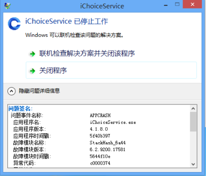

```
问题签名:
  问题事件名称:	APPCRASH
  应用程序名:	iChoiceService.exe
  应用程序版本:	4.1.8.0
  应用程序时间戳:	5f40b397
  故障模块名称:	StackHash_6a44
  故障模块版本:	6.2.9200.17581
  故障模块时间戳:	5644f10e
  异常代码:	c0000374
  异常偏移:	PCH_98_FROM_ntdll+0x00017144
  OS 版本:	6.2.9200.2.0.0.256.48
  区域设置 ID:	2052
  其他信息 1:	6a44
  其他信息 2:	6a4456d6708fcb5d7f9616333732a24b
  其他信息 3:	b68b
  其他信息 4:	b68bf9611cf962ee28ade4eaeb52d453

联机阅读隐私声明:
  http://go.microsoft.com/fwlink/?linkid=190175

如果无法获取联机隐私声明，请脱机阅读我们的隐私声明:
  C:\Windows\system32\zh-CN\erofflps.txt
```

```
Problem signature:
  Problem Event Name:  APPCRASH
  Application Name:  iChoiceService.exe
  Application Version:  4.1.8.0
  Application Timestamp:  5f40b397
  Fault Module Name:  StackHash_5ecc
  Fault Module Version:  6.3.9600.17415
  Fault Module Timestamp:  54504b0d
  Exception Code:  c0000374
  Exception Offset:  PCH_BE_FROM_ntdll+0x0003CEEC
  OS Version:  6.3.9600.2.0.0.768.101
  Locale ID:  1033
  Additional Information 1:  5ecc
  Additional Information 2:  5ecca3e2bd5a39ec0f3c38dc725cfac2
  Additional Information 3:  1b3b
  Additional Information 4:  1b3b3b0dc0688a8ac782b8e9fc292750

Read our privacy statement online:
  http://go.microsoft.com/fwlink/?linkid=280262

If the online privacy statement is not available, please read our privacy statement offline:
  C:\Windows\system32\en-US\erofflps.txt
```

```
Problem signature:
  Problem Event Name:  APPCRASH
  Application Name:  iChoiceService.exe
  Application Version:  4.1.8.0
  Application Timestamp:  5f40b397
  Fault Module Name:  ntdll.dll
  Fault Module Version:  6.3.9600.19678
  Fault Module Timestamp:  5e82c0f7
  Exception Code:  c0000005
  Exception Offset:  000420bd
  OS Version:  6.3.9600.2.0.0.768.101
  Locale ID:  1033
  Additional Information 1:  5861
  Additional Information 2:  5861822e1919d7c014bbb064c64908b2
  Additional Information 3:  9d53
  Additional Information 4:  9d539ab2d38cfad867f683ba4be72a2d

Read our privacy statement online:
  http://go.microsoft.com/fwlink/?linkid=280262

If the online privacy statement is not available, please read our privacy statement offline:
  C:\Windows\system32\en-US\erofflps.txt
```

```
Problem signature:
  Problem Event Name:  APPCRASH
  Application Name:  iChoiceService.exe
  Application Version:  4.1.8.0
  Application Timestamp:  5f40b397
  Fault Module Name:  StackHash_5f51
  Fault Module Version:  6.3.9600.19678
  Fault Module Timestamp:  5e82c0f7
  Exception Code:  c0000374
  Exception Offset:  PCH_16_FROM_ntdll+0x0003C62C
  OS Version:  6.3.9600.2.0.0.768.101
  Locale ID:  1033
  Additional Information 1:  5f51
  Additional Information 2:  5f511a5d56273822432bbed7960de988
  Additional Information 3:  19ee
  Additional Information 4:  19ee4ab33d406401ac21989230e2bd20

Read our privacy statement online:
  http://go.microsoft.com/fwlink/?linkid=280262

If the online privacy statement is not available, please read our privacy statement offline:
  C:\Windows\system32\en-US\erofflps.txt
```

