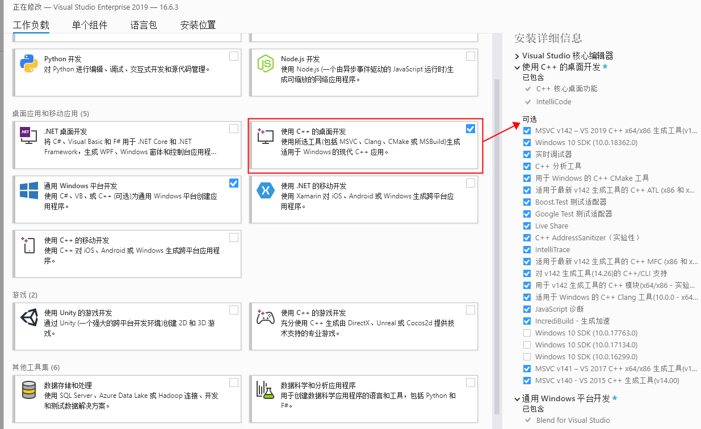
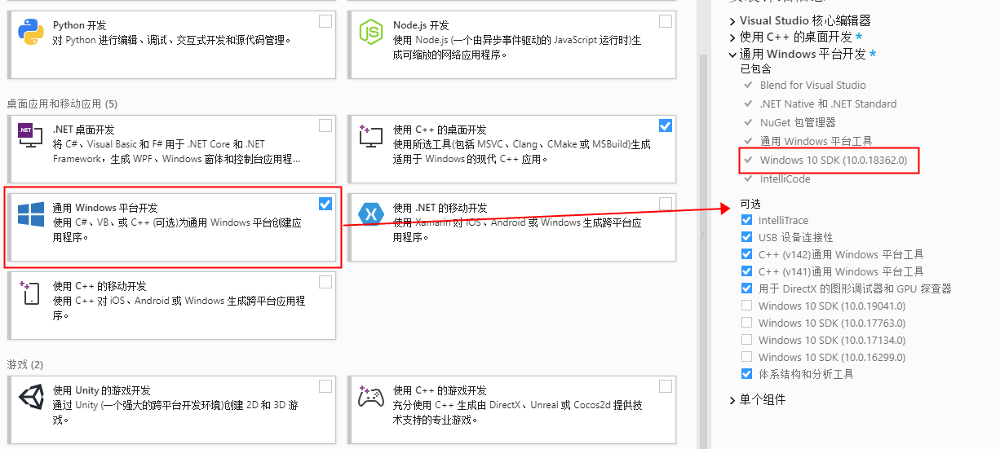
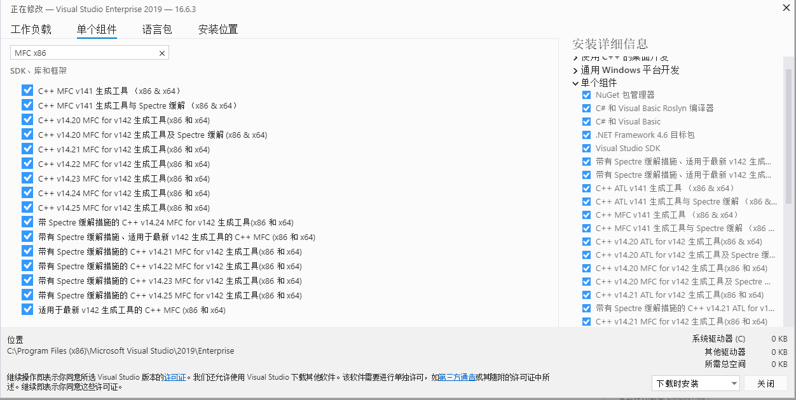
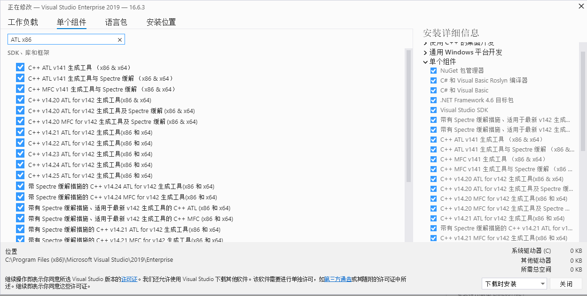
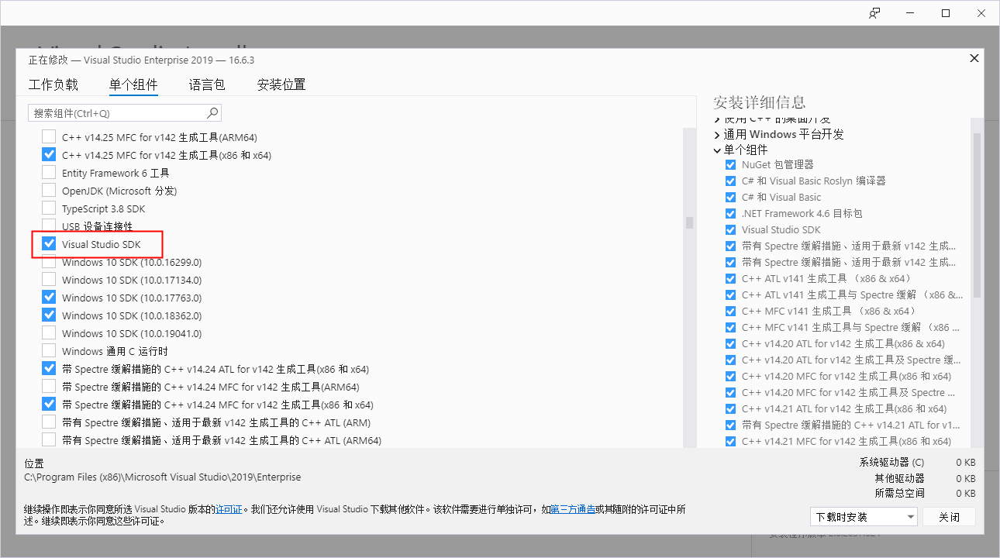
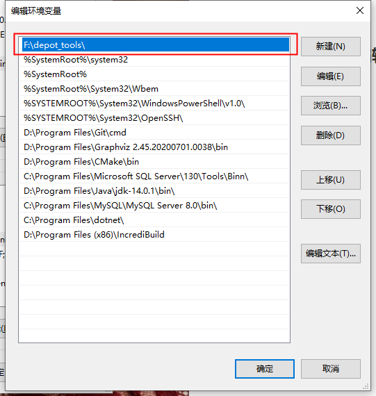
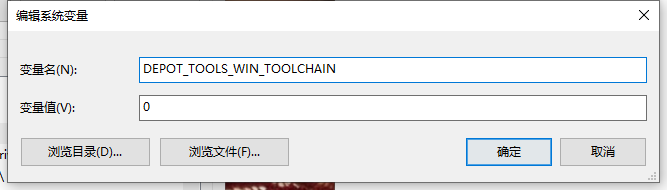
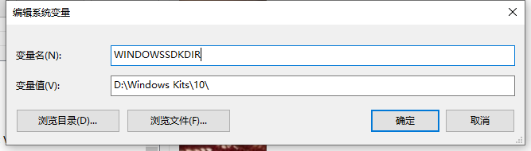
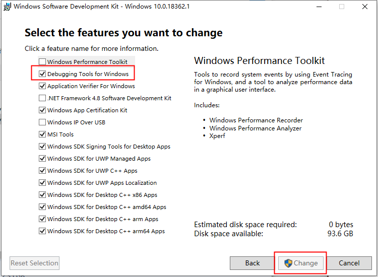
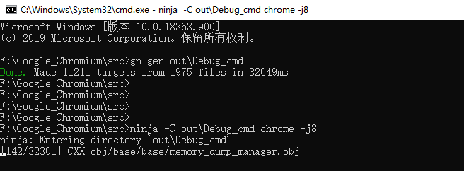

# Chromium项目编译配置

### 下载项目文件与工具

\\\TODO

### 安装Visual Studio

建议VS2019版本为16.6.3

##### 1、勾选使用C++的桌面开发，除了SDK其他全选




##### 2、勾选通用Windows平台开发，除了SDK其他全选，VS会自动安装指定版本的Windows SDK




##### 3、切换单个组件，搜索`MFC x86`，全选




##### 4、切换单个组件，搜索`ATL x86`，全选




##### 5、找到`Visual Studio SDK`，勾选



6、点击安装，C盘充足的情况下建议装在C盘，其他软件安装在其他卷。


### 编辑环境变量

1、添加depot_tools路径至Path系统变量，并且置顶(该工具包内置了特定版本的git和python，depot_tools环境变量需要在任何python和git之前，保证它们被优先执行)



2、新建`DEPOT_TOOLS_WIN_TOOLCHAIN`系统变量，   设置为0



3、新建`WINDOWSSDKDIR`系统变量，设置为安装Visual Studio时同时安装的Windows SDK的路径



4、如果已经安装了VS2019，则不需要也无法安装最新的**SDK 10.0.18362.1**。即VS2019自带最新版SDK，只需要另外安装SDK debug工具。如下：

控制面板-程序-程序和功能-Windows Software Development Kit 右键-更改-change-勾选Debugging Tools for Windows调试工具




### 编译运行

##### 调试版本：

1、进入到工程目录CMD，运行`gn gen out\Default`

也可指定其他文件夹，如果down下来的代码的out文件夹下已经存在编译文件，删除它，其编译文件内某些.dll使用的是绝对路径，大概率不适用当前主机。

2、运行`ninja -C out\Default chrome -j8`

使用命令行进行编译，当电脑CPU为八核心时可以骄傲的加上`-j8`选项，加快编译。



3、在out\Default下可以找到 chrome.exe ，双击浏览器可以运行。


##### VS调试版本：

使用Visual Studio调试时，可以添加ide选项，即`gn gen --ide=vs out\Default`

工程生成后会在 Chromium\src\out\Default\ 下生成 `all.sln`工程文件，双击运行后Build。


##### release版本：

1、新建`release`文件夹

2、运行`gn args out\Release`，会弹出一个文本框，将如下代码粘贴进文本框，保存，关闭，等待生成工程文件

```gn
is_debug = false
dcheck_always_on = true
is_component_build = true
symbol_level = 0
enable_nacl = false
blink_symbol_level=0
```

3、运行`ninja -C out\Release mini_installer`

4、在`out\Release`目录下会看到`mini_installer`的可执行安装文件，以及`chrome.7z`压缩包(用于打包安装指引程序)。


##### **参数优化**
`gn args out/Release_x64`
```gn
is_debug = false
is_component_build = false
is_official_build = false
target_cpu = "x64"
enable_nacl = false
symbol_level = 0
blink_symbol_level = 0
ffmpeg_branding = "Chrome"
enable_iterator_debugging = false
proprietary_codecs = true
```
`ninja -C out/Release_x64 chrome -j4`


`gn args out/Release_x86`
```gn
is_debug = false
is_component_build = false
is_official_build = false
target_cpu = "x86"
enable_nacl = false
symbol_level = 0
blink_symbol_level = 0
ffmpeg_branding = "Chrome"
enable_iterator_debugging = false
proprietary_codecs = true
```
`ninja -C out/Release_x86 chrome -j4`