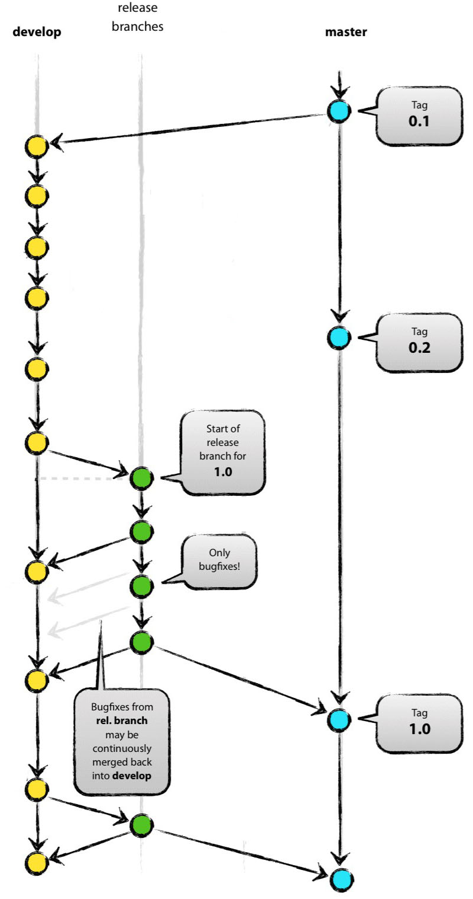

# git 版本控制的使用规范
version:0.1

  - [git 基础命令使用](#git-基础命令使用)
    - [配置工具](#配置工具)
    - [分支](#分支)
    - [创建仓库](#创建仓库)
    - [.gitignore 文件](#gitignore-文件)
    - [同步更改](#同步更改)
    - [进行更改](#进行更改)
    - [重做提交](#重做提交)
    - [术语表](#术语表)
  - [分支模型规范](#分支模型规范)
    - [主分支](#主分支)
    - [辅助分支](#辅助分支)
      - [feature 分支](#feature-分支)
      - [Release 分支](#release-分支)
      - [Hotfix 分支](#hotfix-分支)
  - [版本命名规则](#版本命名规则)

---

## git 基础命令使用
> 详细的git使用教程参看 [ git 官网](https://git-scm.com/doc).

### 配置工具
对本地仓库的本地用户信息进行配置
```
$ git config user.name "[name]"
```
对你的commit操作设置关联的用户名, 用户名采用名字首字母加姓的全拼, 比如: 王小明 >> xmwang
```
$ git config user.email "[email address]"
```
对你的commit操作设置关联的邮箱地址, 没有邮箱地址则设为"用户名@stl", 如上: xmwang@stl

> 全局启用有帮助的彩色命令行输出:
> ```
> $ git config --global color.ui auto
> ```

### 分支
分支是使用 Git 工作的一个重要部分。你做的任何提交都会发生在当前“checked out”到的分支上。使用 git status 查看那是哪个分支。具体的分支模型规范详见下一章节.
```
$ git branch [branch-name]
```
创建一个新分支
```
$ git checkout [branch-name]
```
切换到指定分支并更新工作目录(working directory)
```
$ git merge [branch]
```
将指定分支的历史合并到当前分支。这通常在拉取请求(PR)中完成，但也是一个重要的 Git 操作。
```
$ git branch -d [branch-name]
```
删除指定分支

### 创建仓库
当着手于一个新的仓库时，你只需创建一次。要么在本地创建，然后推送到 GitHub；要么通过 clone 一个现有仓库。
```
$ git init
```
在使用过 git init 命令后，使用以下命令将本地仓库与一个 GitHub 上的空仓库连接起来：
```
$ git remote add origin [url]
```
将现有目录转换为一个 Git 仓库
```
$ git clone [url]
```
Clone（下载）一个已存在于 GitHub 上的仓库，包括所有的文件、分支和提交(commits)

### .gitignore 文件
有时一些文件最好不要用 Git 跟踪。这通常在名为 .gitignore 的特殊文件中完成。你可以在 github.com/github/gitignore 找到有用的 .gitignore 文件模板。

### 同步更改
将你本地仓库与服务器上的远端仓库同步
```
$ git fetch
```
下载远端跟踪分支的所有历史
```
$ git merge
```
将远端跟踪分支合并到当前本地分支
```
$ git push
```
将所有本地分支提交上传到 GitHub
```
$ git pull
```
使用来自 GitHub 的对应远端分支的所有新提交更新你当前的本地工作分支。git pull 是 git fetch 和 git merge 的结合

### 进行更改
浏览并检查项目文件的发展
```
$ git log
```
列出当前分支的版本历史
```
$ git log --follow [file]
```
列出文件的版本历史，包括重命名
```
$ git diff [first-branch]...[second-branch]
```
展示两个分支之间的内容差异
```
$ git show [commit]
```
输出指定commit的元数据和内容变化
```
$ git add [file]
```
将文件进行快照处理用于版本控制
```
$ git commit -m "[descriptive message]"
```
将文件快照永久地记录在版本历史中

### 重做提交
清除错误和构建用于替换的历史
```
$ git reset [commit]
```
撤销所有 [commit] 后的的提交，在本地保存更改
```
$ git reset --hard [commit]
```
放弃所有历史，改回指定提交。

>小心！更改历史可能带来不良后果。如果你需要更改 GitHub（远端）已有的提交，请谨慎操作。如果你需要帮助，可访问 github.community 或联系支持(support)。

### 术语表
- git: 一个开源的分布式版本控制系统
- GitLab: 一个托管和协作管理 Git 仓库的开源平台
- commit 提交: 一个 Git 对象，是你整个仓库的快照的哈希值
- branch 分支: 一个轻型可移动的 commit 指针
- clone: 一个仓库的本地版本，包含所有提交和分支
- remote 远端: 一个 GitHub 上的公共仓库，所有小组成员通过它来交换修改
- fork: 一个属于另一用户的 GitHub 上的仓库的副本
- pull request 拉取请求: 一处用于比较和讨论分支上引入的差异，且具有评审、评论、集成测试等功能的地方
HEAD: 代表你当前的工作目录。使用git checkout 可移动 HEAD 指针到不同的分支、标记(tags)或提交

## 分支模型规范
> 本分支模型主要参考了[ Vincent Driessen 博文 ](https://nvie.com/posts/a-successful-git-branching-model/).


### 主分支
中心仓库保有两条拥有永久生命周期的主分支:
- master
- develop


两条主分支并行存在于整个项目周期, 
- master 分支反映了项目产品稳定版本的变化状态. 
- develop 分支则是反映了各个 release 版本的开发变化. 所以 develop 分支也称为"整合分支", 与辅助分支交互合并, 记录开发过程. 其中当 develop 分支到达了一个稳定的版本时, 就会合并回 master 分支, 同时打上 release 编码, 也就是对应的内部版本号.

### 辅助分支
#### feature 分支

- 功能分支一般创建来自于 develop 分支, 
- 完成开发后必须合并回 develop 分支. 
- 分支命名除了 master, develop, release-*, 或 hotfix-* 以外都是可以的, 尽量采用与所开发功能对应的英文单词, 尽量不用缩写.


从 develop 分支创建功能分支:
```
$ git checkout -b myfeature develop
Switched to a new branch "myfeature"
```

完成开发, 以及必要的测试后, 合并回 develop 分支, 并删除功能分支:
```
$ git checkout develop
Switched to branch 'develop'
$ git merge --no-ff myfeature
Updating ea1b82a..05e9557
(Summary of changes)
$ git branch -d myfeature
Deleted branch myfeature (was 05e9557).
$ git push origin develop
```
> PS: 功能分支内的历史一般不合并到develop分支中, 所以基本都要带上 `--no-ff` flag 来省去, 具体功能见下图.<br>


#### Release 分支

- 功能分支一般创建来自于 develop 分支, 
- 合并回 develop 和 master 分支. 
- 分支命名采用 release-*, * 为对应的 release 编码, 也就是内部版本号.



从 develop 分支创建 release 分支:
```
$ git checkout -b release-1.2 develop
Switched to a new branch "release-1.2"
$ ./bump-version.sh 1.2
Files modified successfully, version bumped to 1.2.
$ git commit -a -m "Bumped version number to 1.2"
[release-1.2 74d9424] Bumped version number to 1.2
1 files changed, 1 insertions(+), 1 deletions(-)
```
> PS: 这里的 bump-version.sh 是修改对应版本信息文件的脚本.


合并到 master 分支, 并打上版本信息 tag :
```
$ git checkout master
Switched to branch 'master'
$ git merge --no-ff release-1.2
Merge made by recursive.
(Summary of changes)
$ git tag -a 1.2
```

合并到 develop 分支:
```
$ git checkout develop
Switched to branch 'develop'
$ git merge --no-ff release-1.2
Merge made by recursive.
(Summary of changes)
```

如果该 release 没必要存在, 则进行删除:
```
$ git branch -d release-1.2
Deleted branch release-1.2 (was ff452fe).
```

#### Hotfix 分支

hotfix 分支用于修复上线产品比较严重的bug.
- hotfix 分支一般创建来自于 master 分支, 
- 合并回 develop 和 master 分支. 
- 分支命名采用 hotfix-*, * 为对应的内部版本号.


从 master 分支创建 hotfix 分支:
```
$ git checkout -b hotfix-1.2.1 master
Switched to a new branch "hotfix-1.2.1"
$ ./bump-version.sh 1.2.1
Files modified successfully, version bumped to 1.2.1.
$ git commit -a -m "Bumped version number to 1.2.1"
[hotfix-1.2.1 41e61bb] Bumped version number to 1.2.1
1 files changed, 1 insertions(+), 1 deletions(-)
```

问题修复后进行提交:
```
$ git commit -m "Fixed severe production problem"
[hotfix-1.2.1 abbe5d6] Fixed severe production problem
5 files changed, 32 insertions(+), 17 deletions(-)
```

合并到 master 分支, 并打上版本信息 tag :
```
$ git checkout master
Switched to branch 'master'
$ git merge --no-ff hotfix-1.2.1
Merge made by recursive.
(Summary of changes)
$ git tag -a 1.2.1
```

合并到 develop 分支:
```
$ git checkout develop
Switched to branch 'develop'
$ git merge --no-ff hotfix-1.2.1
Merge made by recursive.
(Summary of changes)
```

删除 hotfix 分支:
```
$ git branch -d hotfix-1.2.1
Deleted branch hotfix-1.2.1 (was abbe5d6).
```

## 版本命名规则
版本号规则由三部分组成：
- 第一部分为主版本号
- 第二部分为子版本号
- 第三部分为阶段版本号

主版本号： 当功能模块有较大的变动，比如增加多个模块或者整体架构发生变化。此版本号由项目决定是否修改。

子版本号： 当功能有一定的增加或变化，比如增加了多个需求。此版本号由项目决定是否修改。

阶段版本号： 一般是 Bug 修复或是一些小的变动，要经常发布修订版，时间间隔不限，修复一个严重的bug即可发布一个修订版。此版本号由项目经理决定是否修改。

完全的版本号定义：<主版本号>.<子版本号>.<阶段版本号>，如 1.0.0