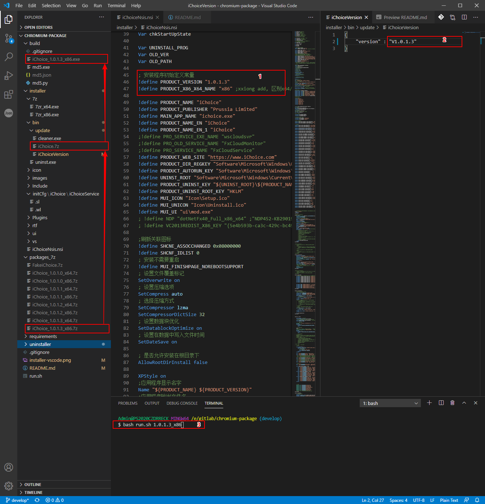
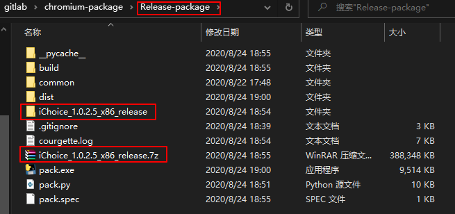
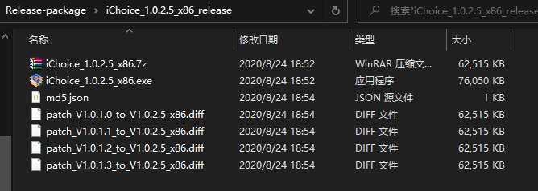

# 浏览器打包
## 生成安装包
版本号： `X.X.X.X`

(压缩包和安装包)命名规则： `program_X.X.X.X_x86|64` 

路径说明：
- `packages_7z`: 存放7z压缩包
- `build`: 存放生成的安装包程序
- `installer`: 安装生成实际根目录，包含nsis脚本及相关包内容

具体流程：
- 拷贝符合命名规则的7z压缩包到`package_7z`中
- 修改版本号及x64|86：
  - `installer/programNsis.nsi`: 修改变量`PRODUCT_VERSION`、`PRODUCT_X86_X64_NAME`
  - `installer\programCfg\program\User Data\programVersion`: 修改`version`
- 生成安装命令：`bash run.sh X.X.X.X_x86|64`
  -  `X.X.X.X` 为对应的版本号，无版本参数则会生成Fakeprogram
  -  `x86|64` 为32位还是64位版本

> **PS**: 生成前请保证版本号的一致性 

例子： 
packages_7z/program_1.0.1.3_x86.7z -> build/program_1.0.1.3_x86.exe 
通过7z包生成对应的安装包exe 
生成安装包命令：`bash run.sh 1.0.1.3_x86` 

## 生成卸载安装包
生成命令：`makensis uninstaller/unistprogram.nsi` 
运行生成的`program_1.0.0.0.exe`, 在`uninstaller/bin`会生成 `uninst.exe`, 拷贝到`installer/bin`目录下即可实现卸载程序的更新

## 生成覆盖安装时的卸载安装包
生成命令：`makensis uninstaller/cleanerChoice.nsi` 
运行生成的`program_1.1.1.1.exe`, 在`uninstaller/bin`会生成 `cleaner.exe`, 拷贝到`installer/update/bin`目录下即可实现卸载程序的更新

## 使用python自动化打包脚本
具体流程：
- 修改版本号及x64|86：
  - `installer/programNsis.nsi`: 修改变量`PRODUCT_VERSION`、`PRODUCT_X86_X64_NAME`
  - `installer\programCfg\program\User Data\programVersion`: 修改`version`
- 生成安装命令：`./pack.exe -v X.X.X.X -pt 86|64 -sr "E:\chromium-stl\src\out\Release_x86"` 或者 `python3 pack.py ...`
  -  `-v X.X.X.X` 为对应的版本号，无版本参数则会生成Fakeprogram
  -  `-pt 86|64` 为32位还是64位版本
  -  `-sr E:\chromium-stl\src\out\Release_x86` chrome.7z 所在的目录

例子： 
生成安装包命令：`./pack.exe -v 1.0.3.8 -pt 64 -sr "E:\browser\chromium-stl\src\out\Official_x64"` 
最终会生成一个目录以及对应的上传压缩包： 

其中目录下包含以下文件: 
