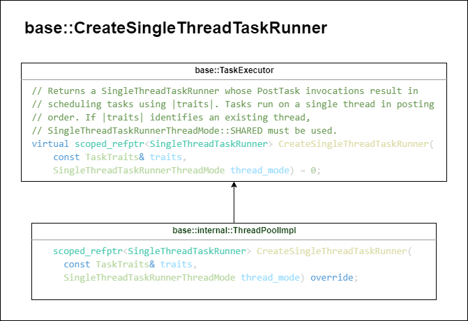
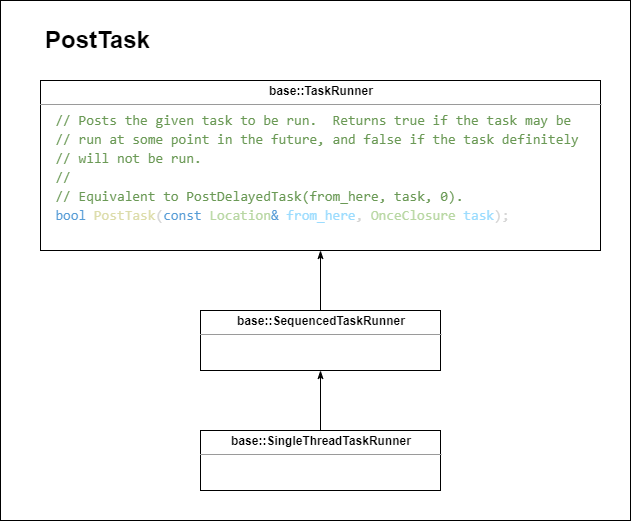
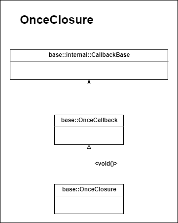

# Threading

## Tasks

## Posting to a Custom SingleThreadTaskRunner
### Official docs (have some problems)
If multiple tasks need to run on the same thread and that thread doesn’t have to
be the main thread or the IO thread, post them to a
`base::SingleThreadTaskRunner` created by
`base::Threadpool::CreateSingleThreadTaskRunner`.

```cpp
scoped_refptr<SingleThreadTaskRunner> single_thread_task_runner =
    base::Threadpool::CreateSingleThreadTaskRunner(...);

// TaskB runs after TaskA completes. Both tasks run on the same thread.
single_thread_task_runner->PostTask(FROM_HERE, base::BindOnce(&TaskA));
single_thread_task_runner->PostTask(FROM_HERE, base::BindOnce(&TaskB));
```

Remember that we [prefer sequences to physical
threads](#prefer-sequences-to-physical-threads) and that this thus should rarely
be necessary.

### Single Thread Task Runner (78.0.3904.97)
#### Create Single Thread Task Runner
1. `base::CreateSingleThreadTaskRunner`<br>
    `base/task/task_executor.h` -> `base/task/thread_pool/thread_pool_impl.h`<br>
    `TaskExecutor (virtual)` -> `ThreadPoolImpl (override)`<br>
    

    `base/task/thread_pool/thread_pool_impl.cc`<br>
    ```c++
    ...

    scoped_refptr<SingleThreadTaskRunner>
    ThreadPoolImpl::CreateSingleThreadTaskRunner(
        const TaskTraits& traits,
        SingleThreadTaskRunnerThreadMode thread_mode) {
    return single_thread_task_runner_manager_.CreateSingleThreadTaskRunner(
        SetUserBlockingPriorityIfNeeded(traits), thread_mode);
    }

    ...
    ```

2. `base::TaskTraits`(TODO: ??)<br>
    ```c++
    // Describes metadata for a single task or a group of tasks.
    class BASE_EXPORT TaskTraits {
    public:
    // ValidTrait ensures TaskTraits' constructor only accepts appropriate types.
    struct ValidTrait {
        ValidTrait(TaskPriority);
        ValidTrait(TaskShutdownBehavior);
        ValidTrait(ThreadPolicy);
        ValidTrait(MayBlock);
        ValidTrait(WithBaseSyncPrimitives);
        ValidTrait(ThreadPool);
    };

    ...
    ```
3. `base::SingleThreadTaskRunnerThreadMode`<br>
    `base/task/single_thread_task_runner_thread_mode.h`<br>
    ```c++
    enum class SingleThreadTaskRunnerThreadMode {
        // Allow the SingleThreadTaskRunner's thread to be shared with others,
        // allowing for efficient use of thread resources when this
        // SingleThreadTaskRunner is idle. This is the default mode and is
        // recommended for thread-affine code.
        SHARED,
        // Create a new thread, dedicated to this SingleThreadTaskRunner, and tear it
        // down when the last reference to the TaskRunner is dropped.
        DEDICATED,
    };
    ```

4. **Example**:<br>
`example.h`
```c++
scoped_refptr<base::SingleThreadTaskRunner> thread_task_runner;
```
`example.cc`
```c++
thread_task_runner = 
    // base::CreateSequencedTaskRunner(
    base::CreateSingleThreadTaskRunner(
    // add to IO thread
    // {content::BrowserThread::IO});
    // // add to customized task runer to thread pool
    {base::ThreadPool()},
    base::SingleThreadTaskRunnerThreadMode::DEDICATED);
```
#### Post Task to Single Thread Task Runner
1. `base::SingleThreadTaskRunner`<br>
    `base::TaskRunner` -> `base::SequencedTaskRunner` -> `base::SingleThreadTaskRunner`<br>
    `base/task_runner.h` -> `base/sequenced_task_runner.h` -> `base/single_thread_task_runner.h`<br>
    
2. `base::Location`<br>
   `base/location.h`<br>
    ```c++
    // Location provides basic info where of an object was constructed, or was
    // significantly brought to life.
    class BASE_EXPORT Location {
    public:
    Location();
    Location(const Location& other);

    // Only initializes the file name and program counter, the source information
    // will be null for the strings, and -1 for the line number.
    // TODO(http://crbug.com/760702) remove file name from this constructor.
    Location(const char* file_name, const void* program_counter);

    // Constructor should be called with a long-lived char*, such as __FILE__.
    // It assumes the provided value will persist as a global constant, and it
    // will not make a copy of it.
    Location(const char* function_name,
            const char* file_name,
            int line_number,
            const void* program_counter);
    
    ...
    // The macros defined here will expand to the current function.
    #if BUILDFLAG(ENABLE_LOCATION_SOURCE)

    // Full source information should be included.
    #define FROM_HERE FROM_HERE_WITH_EXPLICIT_FUNCTION(__func__)
    #define FROM_HERE_WITH_EXPLICIT_FUNCTION(function_name) \
    ::base::Location::CreateFromHere(function_name, __FILE__, __LINE__)

    #else

    // TODO(http://crbug.com/760702) remove the __FILE__ argument from these calls.
    #define FROM_HERE ::base::Location::CreateFromHere(__FILE__)
    #define FROM_HERE_WITH_EXPLICIT_FUNCTION(function_name) \
    ::base::Location::CreateFromHere(function_name, __FILE__, -1)

    #endif
    ...
    ```
3. `base::OnceClosure` = `base::OnceCallback<void()>`<br>
   `base/callback_forward.h`<br>
    ```c++
    ...
    // Syntactic sugar to make OnceClosure<void()> and RepeatingClosure<void()>
    // easier to declare since they will be used in a lot of APIs with delayed
    // execution.
    using OnceClosure = OnceCallback<void()>;
    using RepeatingClosure = RepeatingCallback<void()>;
    using Closure = Callback<void()>;
    ...
    ```
    `base/callback_internal.h` -> `base/callback.h`<br>
    `base::internal::CallbackBase` -> `base::OnceCallback`<br>
    <br>