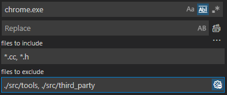

# 修改主程序名称
key word:
- mac：`Google Chrome` -> `yourbrowsername`
- windows: `chrome.exe` -> `yourbrowsername.exe`
- windows: `chrome` -> `yourbrowsername`

Windows (chrome.exe) Modified files:

- `*.cc` (核心代码):
  - **`src/chrome/common/chrome_constants.cc`**
  - **`src/chrome/chrome_proxy/chrome_proxy_main_win.cc`** (Ln 16)[fix: 修正网页快捷方式失效]
  - `src/chrome/browser/browser_switcher/alternative_browser_driver_win.cc`
  - `src/chrome/browser/browser_switcher/bho/browser_switcher_core.cc`
  - `src/chrome/browser/browser_switcher/bho/mini_bho.cc`
  - `src/chrome/browser/profile_resetter/resettable_settings_snapshot.cc`
  - `src/chrome/browser/safe_browsing/incident_reporting/binary_integrity_analyzer_win.cc`
  - `src/chrome/chrome_cleaner/components/system_report_component.cc`
  - `src/chrome/chrome_cleaner/scanner/scanner_controller.cc`
  - `src/chrome/common/media/cdm_host_file_path.cc`
  - `src/chrome/credential_provider/gaiacp/gaia_credential_base.cc`
  - **`src/chrome/installer/launcher_support/chrome_launcher_support.cc`**
  - `src/chrome/installer/util/util_constants.cc`
  - `src/chrome/test/chromedriver/chrome/chrome_finder.cc`
  - `src/components/crash/content/app/hard_error_handler_win.cc`

- `*test.cc` (测试代码):
  - `src/chrome/browser/browser_switcher/browser_switcher_service_browsertest.cc`
  - `src/chrome/browser/safe_browsing/incident_reporting/binary_integrity_analyzer_win_unittest.cc`
  - `src/chrome/chrome_cleaner/components/system_report_component_unittest.cc`
  - `src/chrome/chrome_cleaner/engines/controllers/scanner_controller_impl_unittest.cc`
  - `src/chrome/common/chrome_constants_win_unittest.cc`
  - `src/chrome/credential_provider/test/gcp_gls_output_unittest.cc`
  - `src/chrome/install_static/product_install_details_unittest.cc`
  - `src/chrome/test/delayload/delayloads_unittest.cc`

- `*.py` (辅助代码):
  - `src/build/win/reorder-imports.py`

- others(其他):
  - **`src/chrome/tools/build/win/FILES.cfg`** (Ln 46)
  - **`src/chrome/BUILD.gn`**
  - **`src/chrome/app/chrome_exe.ver`**
  - **`src/chrome/app/chrome_exe.vsprops`**
  - 
  - `src/chrome/install_static/chromium_install_modes.cc`
  - `src/chrome/installer/mini_installer/BUILD.gn`
  - `src/chrome/installer/mini_installer/chrome.release`
  - 
  - `src/chrome/test/BUILD.gn`
