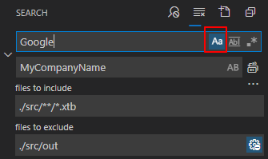
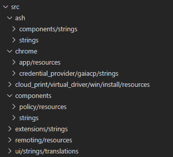

# 语言包 ungoogle

## 查找替换谷歌关键字

查找替换关键字(大小写敏感查找替换)：
- Goole -> MyCompanyName
- Chrome -> MyBrowserName
- Chromium -> MyBrowserName


vs code 查找列子：



### 桌面端语言包文件


- `src\components\policy\resources`
- `src\chrome\app\resources`
- `src\components\strings `
  ```xml
  ... <ph name="BEGIN_LINK_CHROMIUM" />Chromium<ph name="END_LINK_CHROMIUM" /> ...
  ```
  此关键字为chromium的开源申明，不可替换。
- `src\ui\strings\translations`
- `src\extensions\strings`
- `src\remoting\resources`
- `src\ash\components\strings`
- `src\ash\strings`
- `src\chrome\credential_provider\gaiacp\strings`
- `src\cloud_print\virtual_driver\win\install\resources`

### 移动端语言包文件

- Chrome OS： `src\chrome\browser\resources\chromeos\chromevox\strings`
- IOS: 
  - `src\ios\chrome\app\strings\resources`
  - `src\ios\chrome\search_widget_extension\strings\resources`
- Android:
  - `src\content\public\android\java\strings\translations`
  - `src\chrome\android\java\strings\translations`
  - `src\chrome\android\features\vr\java\strings\translations`
  - `src\chrome\android\features\autofill_assistant\java\strings\translations`