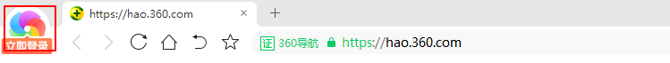

# theme resource
theme root directory:
`src/chrome/app/theme`


## product logo

`src\chrome\app\theme\theme_resources.grd`
```xml
      <if expr="not _google_chrome">
        <structure type="chrome_scaled_image" name="IDR_PRODUCT_LOGO_16" file="chromium/product_logo_16.png" />
        <structure type="chrome_scaled_image" name="IDR_PRODUCT_LOGO_32" file="chromium/product_logo_32.png" />
        <structure type="chrome_scaled_image" name="IDR_PRODUCT_LOGO_WHITE" file="chromium/product_logo_white.png" />
        <structure type="chrome_scaled_image" name="IDR_PRODUCT_LOGO_NAME_22" file="chromium/product_logo_name_22.png" />
      </if>
```

### title logo


`src\chrome\browser\ui\views\frame\browser_view.cc`
```c++
// [@LT](START): add title icon header
#include "ui/views/view.h"
#include "third_party/skia/include/core/SkColor.h"
#include "ui/views/background.h"
#include "base/strings/utf_string_conversions.h"
#include "base/threading/scoped_blocking_call.h"
#include "base/files/file_util.h"
#include "ui/base/resource/resource_bundle.h"
#include "chrome/grit/theme_resources.h"
#include "base/logging.h" // for debug
// [@LT](END): add title icon header

...
void BrowserView::InitViews() {
...
  // [@LT](START): add title logo image view
  views::ImageView* title_logo_view = new views::ImageView();
  title_logo_view->SetBounds(8, 1, 32, 32);
  ui::ResourceBundle& rb = ui::ResourceBundle::GetSharedInstance();
  title_logo_view->SetImage(rb.GetNativeImageNamed(IDR_PRODUCT_LOGO_32).ToImageSkia());
  AddChildView(title_logo_view);
  // [@LT](END): add title logo image view
...
```

`src\chrome\browser\profiles\profile_shortcut_manager_win.cc`
```c++
// Incrementing this number will cause profile icons to be regenerated on
// profile startup (it should be incremented whenever the product/avatar icons
// change, etc).
- const int kCurrentProfileIconVersion = 6;
+ const int kCurrentProfileIconVersion = 7;
```

`src\chrome\browser\ui\views\frame\browser_view_layout.h`
```c++
  // [@LT](START): add const variable of title logo width
  const int kTitleLogoWidth = 40;
  // [@LT](END): add const variable of title logo width
```

`src\chrome\browser\ui\views\frame\browser_view_layout.cc`
```c++
...

//////////////////////////////////////////////////////////////////////////////
// BrowserViewLayout, private:

int BrowserViewLayout::LayoutTabStripRegion(int top) {
  if (!delegate_->IsTabStripVisible()) {
    tab_strip_region_view_->SetVisible(false);
    tab_strip_region_view_->SetBounds(0, 0, 0, 0);
    return top;
  }
  // This retrieves the bounds for the tab strip based on whether or not we show
  // anything to the left of it, like the incognito avatar.
  gfx::Rect tab_strip_region_bounds(
      delegate_->GetBoundsForTabStripRegionInBrowserView());

  // [@LT](START): move tab strip by title logo width
  tab_strip_region_bounds.set_x(
      tab_strip_region_bounds.x() + kTitleLogoWidth);
  tab_strip_region_bounds.set_width(
      tab_strip_region_bounds.width() - kTitleLogoWidth);
  // [@LT](END): move tab strip by title logo width

...
}

int BrowserViewLayout::LayoutWebUITabStrip(int top) {
  if (!webui_tab_strip_ || !webui_tab_strip_->GetVisible())
    return top;
  constexpr int kWebUiTabStripHeightDp = 262;
  // [@LT](START): Move Tab strip to get space of title logo
  webui_tab_strip_->SetBounds(vertical_layout_rect_.x() + kTitleLogoWidth, top,
                              vertical_layout_rect_.width() - kTitleLogoWidth,
                              kWebUiTabStripHeightDp);
  // webui_tab_strip_->SetBounds(vertical_layout_rect_.x(), top,
  //                             vertical_layout_rect_.width(),
  //                             kWebUiTabStripHeightDp);
  // [@LT](END): Move Tab strip to get space of title logo
  return webui_tab_strip_->bounds().bottom();
}

...
```

## Default browser popup icon


`src/chrome/app/vector_icons/chromium/product.icon`
```c
// Copyright 2015 The Chromium Authors. All rights reserved.
// Use of this source code is governed by a BSD-style license that can be
// found in the LICENSE file.

CANVAS_DIMENSIONS, 366,
MOVE_TO, 269.3f, 218.35f,
ARC_TO, 91.06f, 91.06f, 0, 0, 1, 186.66f, 275.24f,
R_CUBIC_TO, -50.21f, 1, -92.12f, -39.5f, -92.82f, -89.72f,
R_ARC_TO, 91, 91, 0, 0, 1, 175, -36.56f,
R_ARC_TO, 5.68f, 5.68f, 0, 0, 0, 5.22f, 3.48f,
R_H_LINE_TO, 83.19f,
R_ARC_TO, 5.69f, 5.69f, 0, 0, 0, 5.55f, -6.89f,
CUBIC_TO, 345.75f, 64.24f, 274.41f, 2.93f, 188.45f, 1.24f,
CUBIC_TO, 85.8f, -0.71f, 1.46f, 83.35f, 3.09f, 186,
R_CUBIC_TO, 1.6f, 99, 82.36f, 178.8f, 181.76f, 178.8f,
ARC_TO, 181.85f, 181.85f, 0, 0, 0, 362.55f, 221.61f,
R_ARC_TO, 5.66f, 5.66f, 0, 0, 0, -5.55f, -6.81f,
H_LINE_TO, 274.55f,
ARC_TO, 5.65f, 5.65f, 0, 0, 0, 269.3f, 218.35f,
CLOSE

// CANVAS_DIMENSIONS, 24,
// MOVE_TO, 12, 7.5f,
// R_H_LINE_TO, 8.9f,
// CUBIC_TO, 19.3f, 4.2f, 15.9f, 2, 12, 2,
// CUBIC_TO, 8.9f, 2, 6.1f, 3.4f, 4.3f, 5.6f,
// R_LINE_TO, 3.3f, 5.7f,
// R_CUBIC_TO, 0.3f, -2.1f, 2.2f, -3.8f, 4.4f, -3.8f,
// CLOSE,
// R_MOVE_TO, 0, 9,
// R_CUBIC_TO, -1.7f, 0, -3.1f, -0.9f, -3.9f, -2.3f,
// LINE_TO, 3.6f, 6.5f,
// CUBIC_TO, 2.6f, 8.1f, 2, 10, 2, 12,
// R_CUBIC_TO, 0, 5, 3.6f, 9.1f, 8.4f, 9.9f,
// R_LINE_TO, 3.3f, -5.7f,
// R_CUBIC_TO, -0.6f, 0.2f, -1.1f, 0.3f, -1.7f, 0.3f,
// CLOSE,
// R_MOVE_TO, 4.5f, -4.5f,
// R_CUBIC_TO, 0, 0.8f, -0.2f, 1.6f, -0.6f, 2.2f,
// LINE_TO, 11.4f, 22,
// R_H_LINE_TO, 0.6f,
// R_CUBIC_TO, 5.5f, 0, 10, -4.5f, 10, -10,
// R_CUBIC_TO, 0, -1.2f, -0.2f, -2.4f, -0.6f, -3.5f,
// R_H_LINE_TO, -6.6f,
// R_CUBIC_TO, 1, 0.8f, 1.7f, 2.1f, 1.7f, 3.5f,
// CLOSE,
// CIRCLE, 12, 12, 3.5
```
具体参考链接：[[chromium docs] vector icons tutorials](https://chromium.googlesource.com/chromium/src/+/master/components/vector_icons/README.md#why-do-we-need-multiple-sizes-of-vector-icons)