# webui 谷歌字段修改

### 2020-08-20_01
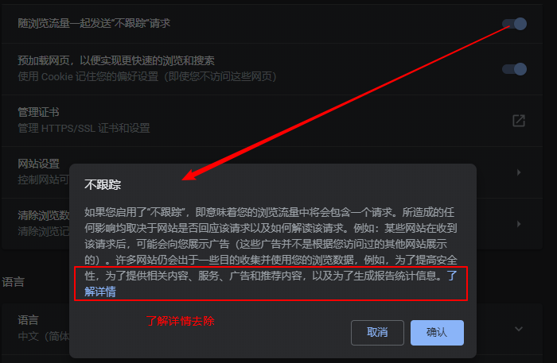

```html
<cr-dialog id="confirmDoNotTrackDialog" close-text="关闭" open="">
    <div slot="title">不跟踪</div>
    <div slot="body">
        如果您启用了“不跟踪”，即意味着您的浏览流量中将会包含一个请求。所造成的任何影响均取决于网站是否回应该请求以及如何解读该请求。例如：某些网站在收到该请求后，可能会向您展示广告（这些广告并不是根据您访问过的其他网站展示的）。许多网站仍会出于一些目的收集并使用您的浏览数据，例如，为了提高安全性，为了提供相关内容、服务、广告和推荐内容，以及为了生成报告统计信息。<a
            target="_blank" href="https://support.google.com/chrome/?p=settings_do_not_track">了解详情</a></div>
    <div slot="button-container">
        <cr-button class="cancel-button" aria-disabled="false" role="button" tabindex="0">
            取消
        </cr-button>
        <cr-button class="action-button" aria-disabled="false" role="button" tabindex="0">
            确认
        </cr-button>
    </div>
</cr-dialog>
```

`src\chrome\browser\resources\settings\privacy_page\privacy_page.html`
```html
<template id="doNotTrackDialogIf" is="dom-if" if="[[showDoNotTrackDialog_]]"
        on-dom-change="onDoNotTrackDomChange_">
    <cr-dialog id="confirmDoNotTrackDialog"
        close-text="$i18n{close}" on-cancel="onDoNotTrackDialogCancel_"
        on-close="onDoNotTrackDialogClosed_">
    <div slot="title">$i18n{doNotTrackDialogTitle}</div>
    <div slot="body">$i18nRaw{doNotTrackDialogMessage}</div>
    <div slot="button-container">
        <cr-button class="cancel-button"
            on-click="onDoNotTrackDialogCancel_">
        $i18n{cancel}
        </cr-button>
        <cr-button class="action-button"
            on-click="onDoNotTrackDialogConfirm_">
        $i18n{confirm}
        </cr-button>
    </div>
    </cr-dialog>
</template>
```

`src\chrome\browser\ui\webui\settings\settings_localized_strings_provider.cc`
```C++
  html_source->AddString(
      "doNotTrackDialogMessage",
      l10n_util::GetStringFUTF16(
          IDS_SETTINGS_ENABLE_DO_NOT_TRACK_DIALOG_TEXT,
#if defined(OS_CHROMEOS)
          GetHelpUrlWithBoard(chrome::kDoNotTrackLearnMoreURL)));
#else
          base::ASCIIToUTF16(chrome::kDoNotTrackLearnMoreURL)));
#endif
```

`src\chrome\app\settings_strings.grdp`
```xml
<message name="IDS_SETTINGS_ENABLE_DO_NOT_TRACK_DIALOG_TEXT" desc="The text of a confirmation dialog that confirms that the user want to send the 'Do Not Track' header">
Enabling "Do Not Track" means that a request will be included with your browsing traffic. Any effect depends on whether a website responds to the request, and how the request is interpreted. For example, some websites may respond to this request by showing you ads that aren't based on other websites you've visited. Many websites will still collect and use your browsing data - for example to improve security, to provide content, services, ads and recommendations on their websites, and to generate reporting statistics. <ph name="BEGIN_LINK">&lt;a target="_blank" href="$1"&gt;</ph>Learn more<ph name="END_LINK">&lt;/a&gt;<ex>&lt;/a&gt;</ex></ph>
</message>
```

Enabling "Do Not Track" means that a request will be included with your browsing traffic. Any effect depends on whether a website responds to the request, and how the request is interpreted. For example, some websites may respond to this request by showing you ads that aren't based on other websites you've visited. Many websites will still collect and use your browsing data - for example to improve security, to provide content, services, ads and recommendations on their websites, and to generate reporting statistics. <ph name="BEGIN_LINK" />Learn more<ph name="END_LINK" />

Enabling 'Do Not Track' means that a request will be included with your browsing traffic. Any effect depends on whether a website responds to the request, and how the request is interpreted. For example, some websites may respond to this request by showing you ads that aren't based on other websites you've visited. Many websites will still collect and use your browsing data – for example, to improve security, to provide content, services, ads and recommendations on their websites, and to generate reporting statistics. <ph name="BEGIN_LINK" />Find out more<ph name="END_LINK" />

### 2020-08-20_02
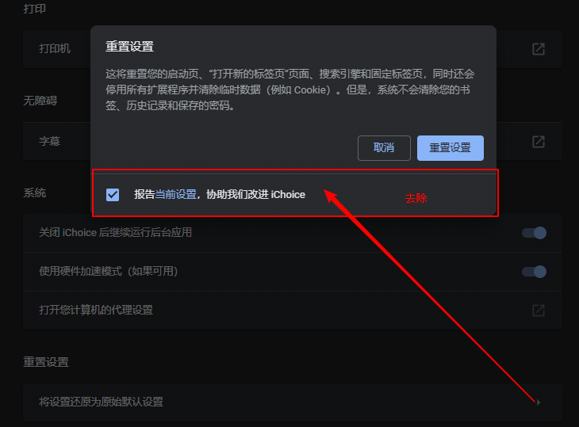

```html
<cr-dialog id="dialog" close-text="关闭" ignore-popstate="" ignore-enter-key="" open="">
    <div slot="title">
        重置设置
    </div>
    <div id="dialog-body" slot="body"><span>
            这将重置您的启动页、“打开新的标签页”页面、搜索引擎和固定标签页，同时还会停用所有扩展程序并清除临时数据（例如 Cookie）。但是，系统不会清除您的书签、历史记录和保存的密码。
        </span></div>
    <div slot="button-container">
        <paper-spinner-lite id="resetSpinner" aria-hidden="true"></paper-spinner-lite>
        <cr-button class="cancel-button" id="cancel" aria-disabled="false" role="button" tabindex="0">
            取消
        </cr-button>
        <cr-button class="action-button" id="reset" aria-disabled="false" role="button" tabindex="0">
            重置设置
        </cr-button>
    </div>
    <div slot="footer">
        <cr-checkbox id="sendSettings" checked="">
            报告<a is="action-link" target="_blank" tabindex="0" role="link">当前设置</a>，协助我们改进 iChoice</cr-checkbox>
    </div>
</cr-dialog>
```

`src\chrome\browser\resources\settings\reset_page\reset_profile_dialog.html`
```html
    <cr-dialog id="dialog" close-text="$i18n{close}"
        ignore-popstate ignore-enter-key>
      <div slot="title">
        [[getPageTitle_(isTriggered_, triggeredResetToolName_)]]
      </div>
      <div id="dialog-body" slot="body">
        <span>
          [[getExplanationText_(isTriggered_, triggeredResetToolName_)]]
          <!-- <a href="$i18nRaw{resetPageLearnMoreUrl}" target="_blank">
            $i18n{learnMore}
          </a> -->
        </span>
      </div>
      <div slot="button-container">
        <paper-spinner-lite id="resetSpinner" active="[[clearingInProgress_]]">
        </paper-spinner-lite>
        <cr-button class="cancel-button" on-click="onCancelTap_"
            id="cancel" disabled="[[clearingInProgress_]]">
          $i18n{cancel}
        </cr-button>
        <cr-button class="action-button" on-click="onResetTap_"
            id="reset" disabled="[[clearingInProgress_]]">
          $i18n{resetDialogCommit}
        </cr-button>
      </div>
      <!-- <div slot="footer">
        <cr-checkbox id="sendSettings" checked>
          $i18nRaw{resetPageFeedback}</cr-checkbox>
      </div> -->
    </cr-dialog>
```

### 2020-08-20_03
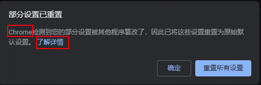
```html
<cr-dialog id="dialog" close-text="关闭" ignore-popstate="" open="">
    <div slot="title">部分设置已重置</div>
    <div slot="body"><span id="description">
            Chrome检测到您的部分设置被其他程序篡改了，因此已将这些设置重置为原始默认设置。
            <a id="learnMore" href="https://support.google.com/chrome/?p=ui_automatic_settings_reset"
                target="_blank">了解详情</a></span></div>
    <div slot="button-container">
        <cr-button class="cancel-button" id="ok" aria-disabled="false" role="button" tabindex="0">
            确定
        </cr-button>
        <cr-button class="action-button" id="reset" aria-disabled="false" role="button" tabindex="0">
            重置所有设置
        </cr-button>
    </div>
</cr-dialog>
```

`src\chrome\browser\ui\webui\settings\settings_localized_strings_provider.cc`
```C++
void AddResetStrings(content::WebUIDataSource* html_source) {
  static constexpr LocalizedString kLocalizedStrings[] = {
#if defined(OS_WIN) && BUILDFLAG(GOOGLE_CHROME_BRANDING)
    {"resetPageTitle", IDS_SETTINGS_RESET_AND_CLEANUP},
#else
    {"resetPageTitle", IDS_SETTINGS_RESET},
#endif
    {"resetTrigger", IDS_SETTINGS_RESET_SETTINGS_TRIGGER},
    {"resetPageExplanation", IDS_RESET_PROFILE_SETTINGS_EXPLANATION},
    {"triggeredResetPageExplanation",
     IDS_TRIGGERED_RESET_PROFILE_SETTINGS_EXPLANATION},
    {"triggeredResetPageTitle", IDS_TRIGGERED_RESET_PROFILE_SETTINGS_TITLE},
    {"resetDialogCommit", IDS_SETTINGS_RESET},
    {"resetPageFeedback", IDS_SETTINGS_RESET_PROFILE_FEEDBACK},
#if defined(OS_CHROMEOS)
    {"powerwashTitle", IDS_SETTINGS_FACTORY_RESET},
    {"powerwashDialogTitle", IDS_SETTINGS_FACTORY_RESET_HEADING},
    {"powerwashDialogExplanation", IDS_SETTINGS_FACTORY_RESET_WARNING},
    {"powerwashDialogButton", IDS_SETTINGS_RESTART},
    {"powerwashLearnMoreUrl", IDS_FACTORY_RESET_HELP_URL},
#endif
    // Automatic reset banner (now a dialog).
    {"resetAutomatedDialogTitle", IDS_SETTINGS_RESET_AUTOMATED_DIALOG_TITLE},
    {"resetProfileBannerButton", IDS_SETTINGS_RESET_BANNER_RESET_BUTTON_TEXT},
    {"resetProfileBannerDescription", IDS_SETTINGS_RESET_BANNER_TEXT},
#if defined(OS_WIN) && BUILDFLAG(GOOGLE_CHROME_BRANDING)
    {"resetCleanupComputerTrigger",
     IDS_SETTINGS_RESET_CLEAN_UP_COMPUTER_TRIGGER},
#endif
  };
  AddLocalizedStringsBulk(html_source, kLocalizedStrings,
                          base::size(kLocalizedStrings));

  html_source->AddString("resetPageLearnMoreUrl",
                         chrome::kResetProfileSettingsLearnMoreURL);
  html_source->AddString("resetProfileBannerLearnMoreUrl",
                         chrome::kAutomaticSettingsResetLearnMoreURL);
```

`src\chrome\browser\resources\settings\reset_page\reset_profile_banner.html`
```html
    <cr-dialog id="dialog" close-text="$i18n{close}" ignore-popstate>
      <div slot="title">$i18n{resetAutomatedDialogTitle}</div>
      <div slot="body">
        <span id="description">
          $i18n{resetProfileBannerDescription}
          <!-- <a id="learnMore"
             href="$i18nRaw{resetProfileBannerLearnMoreUrl}"
             target="_blank">$i18n{learnMore}</a> -->
        </span>
      </div>
      <div slot="button-container">
        <cr-button class="cancel-button" on-click="onOkTap_" id="ok">
          $i18n{ok}
        </cr-button>
        <cr-button class="action-button" on-click="onResetTap_" id="reset">
          $i18n{resetProfileBannerButton}
        </cr-button>
      </div>
    </cr-dialog>
```

`src\chrome\app\settings_strings.grdp`
```xml
  <message name="IDS_SETTINGS_RESET_BANNER_TEXT" desc="The text to show in a banner at the top of the chrome://settings page. The banner is displayed when Chrome detects that some settings have been tampered with and were reset to factory defaults.">
-    Chrome detected that some of your settings were corrupted by another program and reset them to their original defaults.
+    iChoice detected that some of your settings were corrupted by another program and reset them to their original defaults.
  </message>
```
> PS: ID 3665589677786828986 -> 6341044091748849927

### 2020-08-20_04
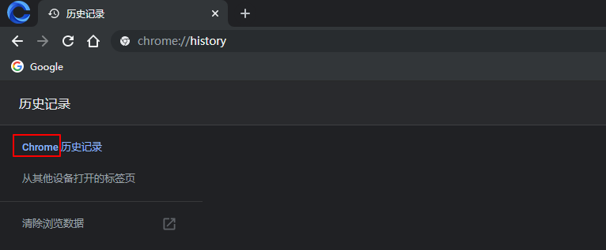
```html
<iron-selector id="menu" selectable=".page-item" attr-for-selected="path"><a href="/" class="page-item iron-selected"
        path="history">
        Chrome history
        <paper-ripple></paper-ripple></a><a href="/syncedTabs" class="page-item" path="syncedTabs">
        Tabs from other devices
        <paper-ripple></paper-ripple></a>
    <div class="separator"></div><a id="clear-browsing-data" href="chrome://settings/clearBrowserData" tabindex="">
        Clear browsing data
        <div class="cr-icon icon-external"></div>
        <paper-ripple id="cbd-ripple"></paper-ripple>
    </a>
    <div id="spacer"></div>
    <div id="footer" hidden="">
        <div class="separator"></div>
        <managed-footnote></managed-footnote>
        <div id="google-account-footer" hidden="">
            <iron-icon icon="cr:info-outline"></iron-icon>
            <div>Your Google Account may have other forms of browsing history at <a target="_blank"
                    href="https://myactivity.google.com/myactivity/?utm_source=chrome_h">myactivity.google.com</a></div>
        </div>
    </div>
</iron-selector>
```
`src\chrome\browser\resources\history\side_bar.html`
```html
    <iron-selector id="menu" selected="{{selectedPage}}"
        selectable=".page-item" attr-for-selected="path"
        on-iron-activate="onSelectorActivate_">
      <a href="/" class="page-item" path="history" on-click="onItemClick_">
        $i18n{historyMenuItem}
        <paper-ripple></paper-ripple>
      </a>
      <a href="/syncedTabs" class="page-item" path="syncedTabs"
          on-click="onItemClick_">
        $i18n{openTabsMenuItem}
        <paper-ripple></paper-ripple>
      </a>
      <div class="separator"></div>
      <a id="clear-browsing-data"
          href="chrome://settings/clearBrowserData"
          on-click="onClearBrowsingDataTap_"
          disabled$="[[guestSession_]]"
          tabindex$="[[computeClearBrowsingDataTabIndex_(guestSession_)]]">
        $i18n{clearBrowsingData}
        <div class="cr-icon icon-external"></div>
        <paper-ripple id="cbd-ripple"></paper-ripple>
      </a>
      <div id="spacer"></div>
      <div id="footer" hidden="[[!showFooter_]]">
        <div class="separator"></div>
        <managed-footnote></managed-footnote>
        <div id="google-account-footer"
             hidden="[[!footerInfo.otherFormsOfHistory]]">
          <iron-icon icon="cr:info-outline"></iron-icon>
          <div>$i18nRaw{sidebarFooter}</div>
        </div>
      </div>
    </iron-selector>
```

`src\chrome\browser\ui\webui\history_ui.cc`
```C++
{"historyMenuItem", IDS_HISTORY_HISTORY_MENU_ITEM},
```

`src\chrome\app\generated_resources.grd`
```xml
<message name="IDS_HISTORY_HISTORY_MENU_ITEM" desc="Label displayed in history sidebar button to display history.">
-   Chrome history
+   iChoice history
</message>
```
> PS: ID 652948702951888897 -> 8142849508257764717

### 2020-08-20_05
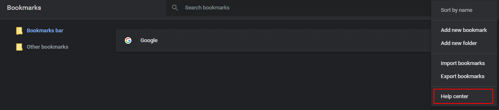
```html
<cr-action-menu><button class="dropdown-item" disabled="" command="15" role="menuitem"><span class="label">
            Sort by name
        </span><span class="sublabel">

        </span></button>
    <hr aria-hidden="true"><button class="dropdown-item" command="16" role="menuitem"><span class="label">
            Add new bookmark
        </span><span class="sublabel">

        </span></button>
    <hr aria-hidden="true" hidden=""><button class="dropdown-item" command="17" role="menuitem"><span class="label">
            Add new folder
        </span><span class="sublabel">

        </span></button>
    <hr aria-hidden="true"><button class="dropdown-item" command="18" role="menuitem"><span class="label">
            Import bookmarks
        </span><span class="sublabel">

        </span></button>
    <hr aria-hidden="true" hidden=""><button class="dropdown-item" command="19" role="menuitem"><span class="label">
            Export bookmarks
        </span><span class="sublabel">

        </span></button>
    <hr aria-hidden="true"><button class="dropdown-item" command="20" role="menuitem"><span class="label">
            Help center
        </span><span class="sublabel">

        </span></button>
    <hr aria-hidden="true" hidden="">
    <dom-repeat as="command" style="display: none;"><template is="dom-repeat"></template></dom-repeat>
</cr-action-menu>
```

`src\chrome\app\bookmarks_strings.grdp`
```xml
  <message name="IDS_BOOKMARK_MANAGER_MENU_HELP_CENTER" desc="Title of the bookmark toolbar dropdown menu item that opens the help center.">
    Help center
  </message>
```

`src\chrome\browser\ui\webui\bookmarks\bookmarks_ui.cc`
```C++
      {"menuHelpCenter", IDS_BOOKMARK_MANAGER_MENU_HELP_CENTER},
```

`src\chrome\browser\resources\bookmarks\command_manager.js`
```js
isCommandVisible_: function(command, itemIds) {
      switch (command) {
        case Command.EDIT:
        case Command.PASTE:
          return itemIds.size == 1 && this.globalCanEdit_;
        case Command.CUT:
        case Command.COPY:
          return itemIds.size >= 1 && this.globalCanEdit_;
        case Command.COPY_URL:
          return this.isSingleBookmark_(itemIds);
        case Command.DELETE:
          return itemIds.size > 0 && this.globalCanEdit_;
        case Command.SHOW_IN_FOLDER:
          return this.menuSource_ == MenuSource.ITEM && itemIds.size == 1 &&
              this.getState().search.term != '' &&
              !this.containsMatchingNode_(itemIds, function(node) {
                return !node.parentId || node.parentId == ROOT_NODE_ID;
              });
        case Command.OPEN_NEW_TAB:
        case Command.OPEN_NEW_WINDOW:
        case Command.OPEN_INCOGNITO:
          return itemIds.size > 0;
        case Command.ADD_BOOKMARK:
        case Command.ADD_FOLDER:
        case Command.SORT:
        case Command.EXPORT:
        case Command.IMPORT:
+          return true;
        case Command.HELP_CENTER:
-          return true;
+          return false;
      }
      return assert(false);
    },

...

case Command.ADD_BOOKMARK:
    /** @type {!BookmarksEditDialogElement} */ (this.$.editDialog.get())
        .showAddDialog(false, assert(state.selectedFolder));
    break;
case Command.ADD_FOLDER:
    /** @type {!BookmarksEditDialogElement} */ (this.$.editDialog.get())
        .showAddDialog(true, assert(state.selectedFolder));
    break;
case Command.IMPORT:
    chrome.bookmarks.import();
    break;
case Command.EXPORT:
    chrome.bookmarks.export();
    break;
case Command.HELP_CENTER:
//   window.open('https://support.google.com/chrome/?p=bookmarks');
  break;
default:
    assert(false);
```

### 2020-08-20_06
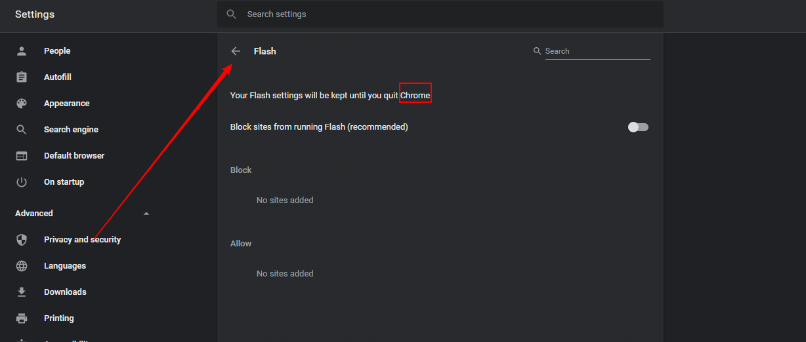
```html
<settings-subpage page-title="Flash" search-label="Search" route-path="/content/flash" no-search=""
    class="iron-selected"><a class="settings-box first no-outline" tabindex="-1" target="_blank">
        Your Flash settings will be kept until you quit Chrome.
    </a>
    <category-default-setting toggle-off-label="Block sites from running Flash (recommended)"
        toggle-on-label="Ask first"></category-default-setting>
    <category-setting-exceptions block-header="Block" read-only-list=""></category-setting-exceptions>
</settings-subpage>
```

`src\chrome\browser\resources\settings\privacy_page\privacy_page.html`
```html
<template is="dom-if" route-path="/content/flash" no-search>
        <settings-subpage page-title="$i18n{siteSettingsFlash}"
            search-label="$i18n{siteSettingsAllSitesSearch}"
            search-term="{{searchFilter_}}">
          <a class="settings-box first no-outline" tabindex="-1"
              target="_blank">
            $i18n{siteSettingsFlashPermissionsEphemeral}
          </a>
          <category-default-setting category="{{ContentSettingsTypes.PLUGINS}}"
              toggle-off-label="$i18n{siteSettingsFlashBlockRecommended}"
              toggle-on-label="$i18n{siteSettingsFlashAskFirst}">
          </category-default-setting>
<if expr="chromeos">
          <a class="settings-box inherit-color no-outline" tabindex="-1"
              target="_blank"
              href="https://www.macromedia.com/support/documentation/en/flashplayer/help/settings_manager07.html">
            <div class="start">$i18n{adobeFlashStorage}</div>
            <cr-icon-button actionable class="icon-external"
                aria-label="$i18n{adobeFlashStorage}"></cr-icon-button>
          </a>
</if>
          <category-setting-exceptions
              category="{{ContentSettingsTypes.PLUGINS}}"
              block-header="$i18n{siteSettingsBlock}" read-only-list
              search-filter="[[searchFilter_]]">
          </category-setting-exceptions>
        </settings-subpage>
      </template>
```

`src\chrome\browser\ui\webui\settings\settings_localized_strings_provider.cc`
```C++
{"siteSettingsFlashPermissionsEphemeral",
     IDS_SETTINGS_SITE_SETTINGS_FLASH_PERMISSIONS_ARE_EPHEMERAL},
```

`src\chrome\app\settings_strings.grdp`
```xml
<message name="IDS_SETTINGS_SITE_SETTINGS_FLASH_PERMISSIONS_ARE_EPHEMERAL" desc="The notice that Flash permissions are ephemeral, at the top of the Flash settings page.">
-   Your Flash settings will be kept until you quit Chrome.
+   Your Flash settings will be kept until you quit iChoice.
</message>
```

> PS: ID 4027951648498485763 -> 922284457389197274

### 2020-08-20_07
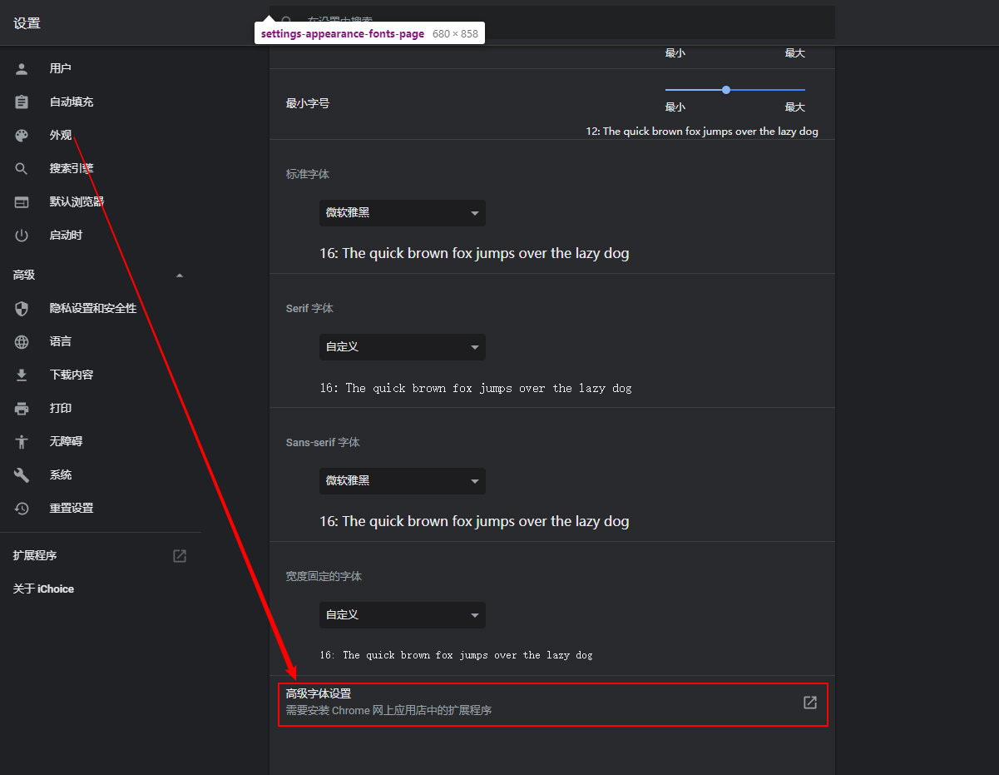
```html
<cr-link-row id="advancedButton" class="hr" label="高级字体设置" external=""></cr-link-row>
```

`src\chrome\browser\resources\settings\appearance_page\appearance_fonts_page.html`
```html
    <!-- <template is="dom-if" if="[[!isGuest_]]">
      <cr-link-row id="advancedButton" class="hr"
          on-click="openAdvancedExtension_" label="$i18n{advancedFontSettings}"
          sub-label="[[advancedExtensionSublabel_]]" external></cr-link-row>
    </template> -->
```

### 2020-08-20_08


`src\chrome\app\resources\generated_resources_zh-CN.xtb`
```xml
<translation id="8780123805589053431">从 Google 获取图片说明</translation>

<translation id="5510775624736435856">从 Google 获取图片说明</translation>
```
`src\chrome\app\resources\generated_resources_en-GB.xtb`
```xml
<translation id="8780123805589053431">Get image descriptions from Google</translation>

<translation id="5510775624736435856">Get Image Descriptions from Google</translation>
```
`src\chrome\app\settings_strings.grdp`
```xml
  <message name="IDS_SETTINGS_ACCESSIBLE_IMAGE_LABELS_TITLE" desc="Description for screen reader image labels feature.">
    Get image descriptions from Google
  </message>
```
> PS: ID 8780123805589053431

`src\chrome\browser\ui\webui\settings\settings_localized_strings_provider.cc`
```C++
    {"accessibleImageLabelsTitle", IDS_SETTINGS_ACCESSIBLE_IMAGE_LABELS_TITLE},
    {"accessibleImageLabelsSubtitle",
     IDS_SETTINGS_ACCESSIBLE_IMAGE_LABELS_SUBTITLE},
```

`src\chrome\browser\resources\settings\a11y_page\a11y_page.js`
```js
  /**
   * @private
   * @param {boolean} hasScreenReader Whether a screen reader is enabled.
   */
  onScreenReaderStateChanged_: function(hasScreenReader) {
    // TODO(katie): Remove showExperimentalA11yLabels flag before launch.
    // this.showAccessibilityLabelsSetting_ = hasScreenReader &&
    //     loadTimeData.getBoolean('showExperimentalA11yLabels');
+       this.showAccessibilityLabelsSetting_ = false;
  },
```

`src\chrome\browser\renderer_context_menu\render_view_context_menu.cc`
```c++
void RenderViewContextMenu::AddAccessibilityLabelsServiceItem(bool is_checked) {
  // if (is_checked) {
  //   menu_model_.AddCheckItemWithStringId(
  //       IDC_CONTENT_CONTEXT_ACCESSIBILITY_LABELS_TOGGLE,
  //       IDS_CONTENT_CONTEXT_ACCESSIBILITY_LABELS_MENU_OPTION);
  // } else {
  //   // Add the submenu if the whole feature is not enabled.
  //   accessibility_labels_submenu_model_.AddItemWithStringId(
  //       IDC_CONTENT_CONTEXT_ACCESSIBILITY_LABELS_TOGGLE,
  //       IDS_CONTENT_CONTEXT_ACCESSIBILITY_LABELS_SEND);
  //   accessibility_labels_submenu_model_.AddItemWithStringId(
  //       IDC_CONTENT_CONTEXT_ACCESSIBILITY_LABELS_TOGGLE_ONCE,
  //       IDS_CONTENT_CONTEXT_ACCESSIBILITY_LABELS_SEND_ONCE);
  //   menu_model_.AddSubMenu(
  //       IDC_CONTENT_CONTEXT_ACCESSIBILITY_LABELS,
  //       l10n_util::GetStringUTF16(
  //           IDS_CONTENT_CONTEXT_ACCESSIBILITY_LABELS_MENU_OPTION),
  //       &accessibility_labels_submenu_model_);
  //   AddGoogleIconToLastMenuItem(&menu_model_);
  // }
}
```
`src\chrome\browser\renderer_context_menu\mock_render_view_context_menu.cc`
```c++
void MockRenderViewContextMenu::AddAccessibilityLabelsServiceItem(
    bool is_checked) {
  // TODO(katie): Is there a way not to repeat this logic from
  // render_view_context_menu.cc?
  // if (is_checked) {
  //   AddCheckItem(IDC_CONTENT_CONTEXT_ACCESSIBILITY_LABELS_TOGGLE,
  //                l10n_util::GetStringUTF16(
  //                    IDS_CONTENT_CONTEXT_ACCESSIBILITY_LABELS_MENU_OPTION));
  // } else {
  //   ui::SimpleMenuModel accessibility_labels_submenu_model_(this);
  //   accessibility_labels_submenu_model_.AddItemWithStringId(
  //       IDC_CONTENT_CONTEXT_ACCESSIBILITY_LABELS_TOGGLE,
  //       IDS_CONTENT_CONTEXT_ACCESSIBILITY_LABELS_SEND);
  //   accessibility_labels_submenu_model_.AddItemWithStringId(
  //       IDC_CONTENT_CONTEXT_ACCESSIBILITY_LABELS_TOGGLE_ONCE,
  //       IDS_CONTENT_CONTEXT_ACCESSIBILITY_LABELS_SEND_ONCE);
  //   AddSubMenu(IDC_CONTENT_CONTEXT_ACCESSIBILITY_LABELS,
  //              l10n_util::GetStringUTF16(
  //                  IDS_CONTENT_CONTEXT_ACCESSIBILITY_LABELS_MENU_OPTION),
  //              &accessibility_labels_submenu_model_);
  // }
}
```

### 2020-08-20_09
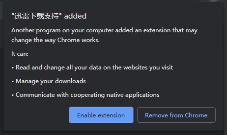

.png)

> PS: ID 8475313423285172237 -> 5688785886776689541

### 2020-08-20_09_00

```xml
      <message name="IDS_EXTENSION_EXTERNAL_INSTALL_PROMPT_ABORT_BUTTON" desc="Button on the external install prompt to remove an extension installed by a third party.">
-       Remove from Chrome
+       Remove from iChoice
      </message>
```
> PS: ID 6326175484149238433 -> 5565384762493564252

### 2020-08-20_09_01
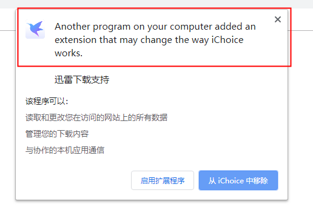
```xml
<ph name="EXTENSION_NAME">$1<ex>Babylon Toolbar</ex></ph>
      </message>
      <message name="IDS_EXTENSION_EXTERNAL_INSTALL_PROMPT_TITLE_EXTENSION" desc="Titlebar of the prompt window for an externally installed extension">
        Another program on your computer added an extension that may change the way Chrome works.

<ph name="EXTENSION_NAME">$1<ex>Babylon Toolbar</ex></ph>
      </message>
```

> PS: ID 1070377999570795893 ->


### 2020-08-20_09_02
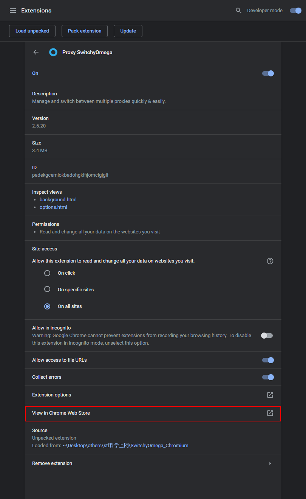

`src\chrome\browser\ui\webui\extensions\extensions_ui.cc`
```C++
{"viewInStore", IDS_EXTENSIONS_ITEM_CHROME_WEB_STORE},
```

`src\chrome\browser\resources\extensions\detail_view.html`
```html
        <cr-link-row class="hr" id="extensions-options"
            disabled="[[!isEnabled_(data.state)]]"
            hidden="[[!shouldShowOptionsLink_(data.*)]]"
            label="$i18n{itemOptions}" on-click="onExtensionOptionsTap_"
            external></cr-link-row>
        <cr-link-row class="hr"
            id="extensionsActivityLogLink" hidden$="[[!showActivityLog]]"
            label="$i18n{viewActivityLog}" on-click="onActivityLogTap_">
        </cr-link-row>
        <cr-link-row class="hr" hidden="[[!data.manifestHomePageUrl.length]]"
            id="extensionWebsite" label="$i18n{extensionWebsite}"
            on-click="onExtensionWebSiteTap_" external></cr-link-row>
        <!-- <cr-link-row class="hr" hidden="[[!data.webStoreUrl.length]]"
            id="viewInStore" label="$i18n{viewInStore}"
            on-click="onViewInStoreTap_" external></cr-link-row> -->
```


### 2020-08-20_10
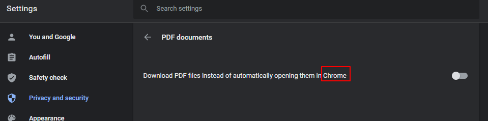

`src\chrome\app\settings_strings.grdp`
```xml
  <message name="IDS_SETTINGS_SITE_SETTINGS_PDF_DOWNLOAD_PDFS" desc="Label for downloading PDF documents instead of automatically opening them in Chrome.">
-   Download PDF files instead of automatically opening them in Chrome
+   Download PDF files instead of automatically opening them in iChoice
```

`src\chrome\browser\ui\webui\settings\settings_localized_strings_provider.cc`
```C++
    {"siteSettingsPdfDownloadPdfs",
     IDS_SETTINGS_SITE_SETTINGS_PDF_DOWNLOAD_PDFS},
```

> PS: ID 592880897588170157 -> 7834275542553367223

### 2020-09-17_11
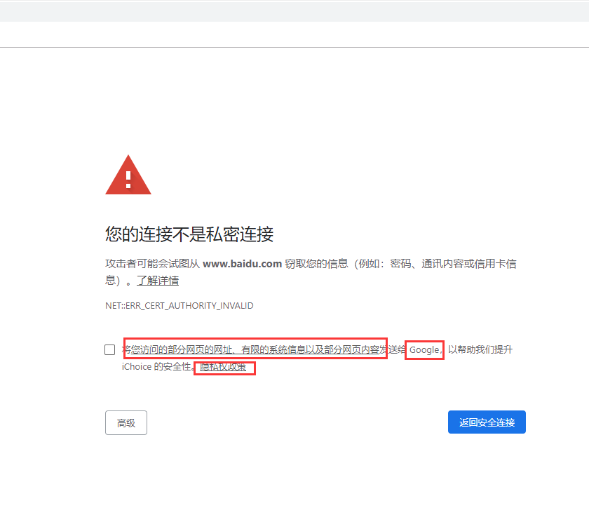


`src\components\security_interstitials\core\browser\resources\interstitial_large.html`
```html
...
      <div id="extended-reporting-opt-in" class="hidden">
        <label>
          <div class="checkboxes">
            <input type="checkbox" id="opt-in-checkbox">
            <span class="checkbox"></span>
          </div>
          <span id="opt-in-label"></span>
        </label>
      </div>
    </div>
...
```
`src\components\security_interstitials_strings.grdp`
```xml
  <message name="IDS_SAFE_BROWSING_SCOUT_REPORTING_AGREE" desc="SafeBrowsing Scout label next to checkbox">
-   Help improve Chrome security by sending <ph name="BEGIN_WHITEPAPER_LINK">&lt;a href="#" id="whitepaper-link"&gt;</ph>URLs of some pages you visit, limited system information, and some page content<ph name="END_WHITEPAPER_LINK">&lt;/a&gt;</ph> to Google. <ph name="PRIVACY_PAGE_LINK">$1</ph>
+   Help improve iChoice security by sending URLs of some pages you visit, limited system information, and some page content to iChoice.
  </message>
```

`src\components\strings\components_strings_zh-CN.xtb`
```xml
- <translation id="1974883374937189061">将<ph name="BEGIN_WHITEPAPER_LINK" />您访问的部分网页的网址、有限的系统信息以及部分网页内容<ph name="END_WHITEPAPER_LINK" />发送给 Google，以帮助我们提升 Chrome 的安全性。<ph name="PRIVACY_PAGE_LINK" /></translation>
+ <translation id="1974883374937189061">将您访问的部分网页的网址、有限的系统信息以及部分网页内容发送给 iChoice，以帮助我们提升 iChoice 的安全性。</translation>
```

`src\components\security_interstitials\core\safe_browsing_loud_error_ui.cc`
```c++
  // const std::string privacy_link = base::StringPrintf(
  //     security_interstitials::kPrivacyLinkHtml,
  //     security_interstitials::CMD_OPEN_REPORTING_PRIVACY,
  //     l10n_util::GetStringUTF8(IDS_SAFE_BROWSING_PRIVACY_POLICY_PAGE).c_str());
  load_time_data->SetString(
      security_interstitials::kOptInLink,
      // l10n_util::GetStringFUTF16(IDS_SAFE_BROWSING_SCOUT_REPORTING_AGREE,
      //                            base::UTF8ToUTF16(privacy_link)));
      l10n_util::GetStringUTF16(IDS_SAFE_BROWSING_SCOUT_REPORTING_AGREE));
  load_time_data->SetBoolean(security_interstitials::kBoxChecked,
                             is_extended_reporting_enabled());
}
```

`src\chrome\browser\ssl\cert_report_helper.cc`
```c++
  // const std::string privacy_link = base::StringPrintf(
  //     security_interstitials::kPrivacyLinkHtml,
  //     security_interstitials::CMD_OPEN_REPORTING_PRIVACY,
  //     l10n_util::GetStringUTF8(IDS_SAFE_BROWSING_PRIVACY_POLICY_PAGE).c_str());

  load_time_data->SetString(
      security_interstitials::kOptInLink,
      // l10n_util::GetStringFUTF16(IDS_SAFE_BROWSING_SCOUT_REPORTING_AGREE,
      //                            base::UTF8ToUTF16(privacy_link)));
      l10n_util::GetStringUTF16(IDS_SAFE_BROWSING_SCOUT_REPORTING_AGREE));
}
```
PS: ID 1974883374937189061 3662223494981330302

## webui seting directories

`src\chrome\browser\resources\settings\lifetime_browser_proxy.js`

`src\chrome\browser\ui\webui\settings`

`src\chrome\browser\ui\webui\settings\search_engines_handler.cc`

`src\chrome\browser\ui\webui\settings\browser_lifetime_handler.cc`

`src\chrome\browser\ui\webui\settings\settings_default_browser_handler.cc`

`src\chrome\browser\ui\webui\settings\settings_startup_pages_handler.cc`


## C++ Connection

### 重启按钮
```html
<cr-button id="restartButton" aria-disabled="false" role="button" tabindex="0">
    Relaunch
</cr-button>
```