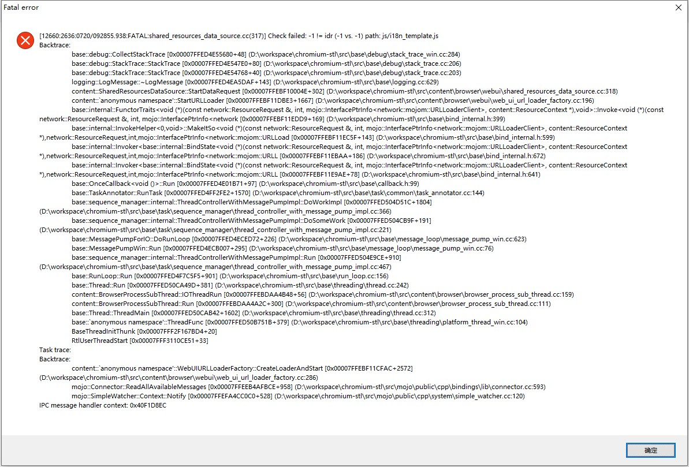

# Chrome WebUI interface

Creating a Chrome WebUI interface is simple yet involves changing a number of files. This guide briefly steps over the process. For brevity, copyright notices are not placed at the beginning of the new files but in practice do not forget to add these.

```sh
src
├──chrome
    ├──browser
    |   ├──resources  
    |   |   | #1 Creating the WebUI page
    |   |   ├──hello_world.html
    |   |   ├──hello_world.css
    |   |   └──hello_world.js #8+ Adding a callback handler #10+ Passing arguments to the WebUI
    |   └──browser_resources.grd #2+ Adding the resources to Chrome
    |   ├──ui
    |   |   ├──webui 
    |   |   |   | #5 Adding a WebUI class for handling requests to the chrome://hello-world/ URL
    |   |   |   ├──hello_world_ui.h #9+- Creating a WebUI Dialog
    |   |   |   └──hello_world_ui.cc
    |   |   |   | #8 Adding a callback handler
    |   |   |   ├──hello_world_handler.h 
    |   |   |   └──hello_world_handler.cc 
    |   |   |   | #7+ Adding your WebUI request handler to the Chrome WebUI factory
    |   |   |   └──chrome_web_ui_controller_factory.cc 
    |   |   |   |  #9 Creating a WebUI Dialog
    |   |   |   ├──hello_world.h #10+- Passing arguments to the WebUI
    |   |   |   └──hello_world.cc #10+- Passing arguments to the WebUI
    |   |   └──BUILD.gn #6+ Adding new sources to Chrome
    ├──common 
    |   | #3+ Adding URL constants for new chrome URL
    |   ├──webui_url_constants.h
    |   └──webui_url_constants.cc
    └──app #4+ Adding localized strings
        └──generated_resources.grd

```

## 1. Creating the WebUI page
WebUI resources are located in the resources folder, src/chrome/browser/resources. When creating WebUI resources, follow the Web Development Style Guide. For a sample WebUI page you could start with the following files:

`src/chrome/browser/resources/hello_world.html`:
```html
<!-- ERROR: Error version from official website. -->
<!DOCTYPE HTML>
<html i18n-values="dir:textdirection">
<head>
  <meta charset="utf-8">
  <title i18n-content="helloWorldTitle"></title>
  <link rel="stylesheet" href="hello_world.css">
  <script src="chrome://resources/js/cr.js"></script>
  <script src="chrome://resources/js/load_time_data.js"></script>
  <script src="chrome://resources/js/util.js"></script>
  <script src="strings.js"></script>
  <script src="hello_world.js"></script>
</head>
<body i18n-values=".style.fontFamily:fontfamily;.style.fontSize:fontsize">
  <h1 i18n-content="helloWorldTitle"></h1>
  <p id="welcome-message"></p>
 <script src="chrome://resources/js/i18n_template.js"></script>
</body>
</html>
```
The original code in official document will case following error becasue of the `i18n_template.js`：


Remove the code about **i18n** can solve it, as following code:
```html
<!DOCTYPE HTML>
<html>
<head>
  <meta charset="utf-8">
  <title>helloWorldTitle</title>
  <link rel="stylesheet" href="hello_world.css">
  <script src="chrome://resources/js/cr.js"></script>
  <script src="chrome://resources/js/load_time_data.js"></script>
  <script src="chrome://resources/js/util.js"></script>
  <script src="strings.js"></script>
  <script src="hello_world.js"></script>
</head>
<body>
  <h1>helloWorldTitle</h1>
  <p id="welcome-message"></p>
</body>
</html>
```

`src/chrome/browser/resources/hello_world.css`:
```css

p {
  white-space: pre-wrap;
}
```

`src/chrome/browser/resources/hello_world.js`:
```js
cr.define('hello_world', function() {
  'use strict';

  /**
   * Be polite and insert translated hello world strings for the user on loading.
   */
  function initialize() {
    $('welcome-message').textContent = loadTimeData.getStringF('welcomeMessage',
        loadTimeData.getString('userName'));
  }

  // Return an object with all of the exports.
  return {
    initialize: initialize,
  };
});

document.addEventListener('DOMContentLoaded', hello_world.initialize);
```

## 2. Adding the resources to Chrome
Resources files are added to Chrome using the `src/chrome/browser/browser_resources.grd` file. The following additions add our hello_world files:

`src/chrome/browser/browser_resources.grd`:
```html
+ <include name="IDR_HELLO_WORLD_HTML" file="resources\hello_world.html" type="BINDATA" />
+ <include name="IDR_HELLO_WORLD_CSS" file="resources\hello_world.css" type="BINDATA" />
+ <include name="IDR_HELLO_WORLD_JS" file="resources\hello_world.js" type="BINDATA" />
```

## 3. Adding URL constants for new chrome URL

URL constants are stored in the files `src/chrome/common/webui_url_constants.*`. This is where you will add the URL or URL's which will be directed to your new resources.

> PS: Change `url_constant` (*official doc*) to `webui_url_constant`
> - `url_constant` : define the url of google website, such as "https://support.google.com/..."
> - `webui_url_constant` : define the webui url, such as "chrome://..."


`src/chrome/common/webui_url_constants.h`:
```c
+ extern const char kChromeUIHelloWorldURL[];
...
+ extern const char kChromeUIHelloWorldHost[];

`src/chrome/common/webui_url_constants.cc`:
+ const char kChromeUIHelloWorldURL[] = "chrome://hello-world/";
...
+ const char kChromeUIHelloWorldHost[] = "hello-world";
```

## 4. Adding localized strings

We need a few string resources for translated strings to work on the new resource. The welcome message contains a variable with a sample value so that it can be accurately translated.

`src/chrome/app/generated_resources.grd`:
```xml
+ <message name="IDS_HELLO_WORLD_TITLE" desc="A happy message saying hello to the world">
+   Hello World!
+ </message>
+ <message name="IDS_HELLO_WORLD_WELCOME_TEXT" desc="Message welcoming the user to the hello world page">
+   Welcome to this fancy Hello World page <ph name="WELCOME_NAME">$1<ex>Chromium User</ex></ph>!
+ </message>
```

## 5. Adding a WebUI class for handling requests to the chrome://hello-world/ URL

Next we need a class to handle requests to this new resource URL. Typically this will subclass ChromeWebUI (but WebUI dialogs should subclass HtmlDialogUI instead).

`src/chrome/browser/ui/webui/hello_world_ui.h`:
```C++
#ifndef CHROME_BROWSER_UI_WEBUI_HELLO_WORLD_UI_H_
#define CHROME_BROWSER_UI_WEBUI_HELLO_WORLD_UI_H_
#pragma once

#include "base/macros.h"
#include "content/public/browser/web_ui_controller.h"

// The WebUI for chrome://hello-world
class HelloWorldUI : public content::WebUIController {
 public:
  explicit HelloWorldUI(content::WebUI* web_ui);
  ~HelloWorldUI() override;
 private: 
  DISALLOW_COPY_AND_ASSIGN(HelloWorldUI);
};

#endif  // CHROME_BROWSER_UI_WEBUI_HELLO_WORLD_UI_H_
```

`src/chrome/browser/ui/webui/hello_world_ui.cc`:
```C++
#include "chrome/browser/ui/webui/hello_world_ui.h"

#include "chrome/browser/profiles/profile.h"
#include "chrome/common/webui_url_constants.h"
#include "chrome/grit/browser_resources.h"
#include "chrome/grit/generated_resources.h"
#include "content/public/browser/web_ui_data_source.h"

HelloWorldUI::HelloWorldUI(content::WebUI* web_ui)
    : content::WebUIController(web_ui) {
  // Set up the chrome://hello-world source.
  content::WebUIDataSource* html_source =
      content::WebUIDataSource::Create(chrome::kChromeUIHelloWorldHost);

  // Localized strings.
  html_source->AddLocalizedString("helloWorldTitle", IDS_HELLO_WORLD_TITLE);
  html_source->AddLocalizedString("welcomeMessage", IDS_HELLO_WORLD_WELCOME_TEXT);

  // As a demonstration of passing a variable for JS to use we pass in the name "Bob".
  html_source->AddString("userName", "Bob");
  // html_source->SetJsonPath("strings.js"); // ERROR: No function, change to `UseStringsJs()`
  html_source->UseStringsJs();

  // Add required resources.
  html_source->AddResourcePath("hello_world.css", IDR_HELLO_WORLD_CSS);
  html_source->AddResourcePath("hello_world.js", IDR_HELLO_WORLD_JS);
  html_source->SetDefaultResource(IDR_HELLO_WORLD_HTML);

  Profile* profile = Profile::FromWebUI(web_ui);
  content::WebUIDataSource::Add(profile, html_source);
}

HelloWorldUI::~HelloWorldUI() {
}
```

## 6. Adding new sources to Chrome

In order for your new class to be built and linked in it needs to be added to the project gypi file.

`src/chrome/browser/ui/BUILD.gn`:
```c
sources = [
...
+   "webui/hello_world_ui.cc",
+   "webui/hello_world_ui.h",
...
]
...
```

## 7. Adding your WebUI request handler to the Chrome WebUI factory

The Chrome WebUI factory is where you setup your new request handler.

`src/chrome/browser/ui/webui/chrome_web_ui_controller_factory.cc`:
```c
+ #include "chrome/browser/ui/webui/hello_world_ui.h"
...
+ if (url.host_piece() == chrome::kChromeUIHelloWorldHost)
+   return &NewWebUI<HelloWorldUI>;
```

## 7.1. Testing

You're done! Assuming no errors (because everyone gets their code perfect the first time) you should be able to compile and run chrome and navigate to `chrome://hello-world/` and see your nifty welcome text!

## 8. Adding a callback handler
You probably want your new WebUI page to be able to do something or get information from the C++ world. For this, we use message callback handlers. Let's say that we don't trust the Javascript engine to be able to add two integers together (since we know that it uses floating point values internally). We could add a callback handler to perform integer arithmetic for us.

`src/chrome/browser/ui/webui/hello_world_handler.h`:
```c++
#ifndef CHROME_BROWSER_UI_WEBUI_HELLO_WORLD_HANDLER_H_
#define CHROME_BROWSER_UI_WEBUI_HELLO_WORLD_HANDLER_H_

#include "base/macros.h"
#include "base/values.h"
#include "content/public/browser/web_ui_message_handler.h"

// The WebUI for chrome://hello-world
class HelloWorldHandler : public content::WebUIMessageHandler {
 public:
  HelloWorldHandler();
  ~HelloWorldHandler() override;

  // WebUIMessageHandler implementation.
  void RegisterMessages() override;

 private: 
  // Add two numbers together using integer arithmetic.
  void AddNumbers(const base::ListValue* args);

  DISALLOW_COPY_AND_ASSIGN(HelloWorldHandler);
};

#endif  // CHROME_BROWSER_UI_WEBUI_HELLO_WORLD_HANDLER_H_
```
`src/chrome/browser/ui/webui/hello_world_handler.cc`:
```C++
#include "chrome/browser/ui/webui/hello_world_handler.h"

#include "base/bind.h"

HelloWorldHandler::HelloWorldHandler() {
}

HelloWorldHandler::~HelloWorldHandler() {
}

// WebUIMessageHandler implementation.
void HelloWorldHandler::RegisterMessages() {
  web_ui()->RegisterMessageCallback("hello_world.addNumbers",
      base::BindRepeating(&HelloWorldHandler::AddNumbers,
                          base::Unretained(this)));
}
// Add two numbers together using integer arithmetic.
void HelloWorldHandler::AddNumbers(const base::ListValue* args) {
  AllowJavascript();
  int term1, term2;
  if (!args->GetInteger(0, &term1) || !args->GetInteger(1, &term2))
    return;
  base::Value result(term1 + term2);
  CallJavascriptFunction("hello_world.addResult", result);
}
```

`src/chrome/browser/ui/webui/hello_world_ui.cc`:
```C++
#include "chrome/browser/ui/webui/hello_world_ui.h"
+ #include "chrome/browser/ui/webui/hello_world_handler.h"
...
+  // set up message handler
+ web_ui->AddMessageHandler(std::make_unique<HelloWorldHandler>());
  // Set up the chrome://hello-world source.
  content::WebUIDataSource* html_source =
      content::WebUIDataSource::Create(chrome::kChromeUIHelloWorldHost);
...
}
...

```
Adding new sources to Chrome: `src/chrome/browser/ui/BUILD.gn`:
```c
sources = [
...
    "webui/hello_world_ui.cc",
    "webui/hello_world_ui.h",
+   "webui/hello_world_handler.cc",
+   "webui/hello_world_handler.h",
...
]
...
```

`src/chrome/browser/resources/hello_world.js`:
```js
    function initialize() {
+     chrome.send('addNumbers', [2, 2]);
    }
+
+   function addResult(result) {
+     alert('The result of our C++ arithmetic: 2 + 2 = ' + result);
+   }

    return {
+     addResult: addResult,
      initialize: initialize,
    };
```

You'll notice that the call is asynchronous. We must wait for the C++ side to call our Javascript function to get the result.

## 9. JSON string

## 10. Creating a WebUI Dialog
Once you've created a WebUI resource following the above instructions, there are two changes necessary to make it a dialog. You must subclass the `HtmlDialogUI` class instead of `ChromeWebUI` and create an `HtmlDialogUIDelegate` class which will be responsible for running the dialog.

1. Instead of subclassing the `ChromeWebUI` class as above you will need an instance of HtmlDialogUI.

    `src/chrome/browser/ui/webui/hello_world_ui.h`:
    ```C++
    - #include "#chrome/browser/ui/webui/chrome_web_ui.h"
    + #include "#chrome/browser/ui/webui/html_dialog_ui.h"

    - class HelloWorldUI : public ChromeWebUI {
    + class HelloWorldUI : public HtmlDialogUI {
    ```

2. Create an `HtmlDialogUIDelegate` class which is used to instantiate the dialog. For brevity each of these functions are stubbed out with the minimal code possible.

    `src/chrome/browser/ui/webui/hello_world.h`:
    ```C++
    #ifndef CHROME_BROWSER_UI_WEBUI_HELLO_WORLD_H_
    #define CHROME_BROWSER_UI_WEBUI_HELLO_WORLD_H_
    #pragma once

    #include "chrome/browser/ui/webui/html_dialog_ui.h"

    class HelloWorldDialog : private HtmlDialogUIDelegate {
    public:
    // Shows the Hello World dialog.
    static void ShowDialog();
    virtual ~HelloWorldDialog();

    private:
    // Construct a Hello World dialog
    explicit HelloWorldDialog();

    // Overridden from HtmlDialogUI::Delegate:
    virtual bool IsDialogModal() const OVERRIDE;
    virtual string16 GetDialogTitle() const OVERRIDE;
    virtual GURL GetDialogContentURL() const OVERRIDE;
    virtual void GetWebUIMessageHandlers(
        std::vector<WebUIMessageHandler*>* handlers) const OVERRIDE;
    virtual void GetDialogSize(gfx::Size* size) const OVERRIDE;
    virtual std::string GetDialogArgs() const OVERRIDE;
    virtual void OnDialogClosed(const std::string& json_retval) OVERRIDE;
    virtual void OnCloseContents(
        TabContents* source, bool* out_close_dialog) OVERRIDE;
    virtual bool ShouldShowDialogTitle() const OVERRIDE;

    DISALLOW_COPY_AND_ASSIGN(HelloWorldDialog);
    };

    #endif  // CHROME_BROWSER_UI_WEBUI_HELLO_WORLD_H_
    ```

    `src/chrome/browser/ui/webui/hello_world.cc`:
    ```C++
    #include "base/utf_string_conversions.h"
    #include "chrome/browser/ui/browser.h"
    #include "chrome/browser/ui/browser_list.h"
    #include "chrome/browser/ui/webui/hello_world.h"
    #include "chrome/common/webui_url_constants.h"

    void HelloWorldDialog::ShowDialog() {
    Browser* browser = BrowserList::GetLastActive();
    DCHECK(browser);
    browser->BrowserShowHtmlDialog(new HelloWorldDialog(), NULL);
    }

    HelloWorldDialog::HelloWorldDialog() {
    }

    HelloWorldDialog::~HelloWorldDialog() {
    }

    bool HelloWorldDialog::IsDialogModal() {
    return false;
    }

    string16 HelloWorldDialog::GetDialogTitle() {
    return UTF8ToUTF16("Hello World");
    }

    GURL HelloWorldDialog::GetDialogContentURL() const {
    return GURL(chrome::kChromeUIHelloWorldURL);
    }

    void HelloWorldDialog::GetWebUIMessageHandlers(
        std::vector<WebUIMessageHandler*>* handlers) const {
    }

    void HelloWorldDialog::GetDialogSize(gfx::Size* size) const {
    size->SetSize(600, 400);
    }

    std::string HelloWorldDialog::GetDialogArgs() const {
    return std::string();
    }

    void HelloWorldDialog::OnDialogClosed(const std::string& json_retval) {
    delete this;
    }

    void HelloWorldDialog::OnCloseContents(TabContents* source,
        bool* out_close_dialog) {
    if (out_close_dialog)
        *out_close_dialog = true;
    }

    bool HelloWorldDialog::ShouldShowDialogTitle() const {
    return true;
    }
    ```

You can invoke this new dialog by calling `HelloWorldDialog::ShowDialog()`.

## 11. Passing arguments to the WebUI
As you may have guessed, the `HtmlDialogUIDelegate::GetDialogArgs()` function call is used for passing arguments to a dialog page. For example, if we wanted to have a custom message displayed to the user depending on some argument known only at dialog creation we could pass that argument in during construction, return it from GetDialogArgs, and access it in Javascript from chrome.dialogArguments as follows:

`src/chrome/browser/ui/webui/hello_world.h`:
```C++
-   static void ShowDialog();
+   static void ShowDialog(std::string message);

+   // The message to be displayed to the user.
+   std::string message_;
+
    DISALLOW_COPY_AND_ASSIGN(HelloWorldDialog);
  };
```

`src/chrome/browser/ui/webui/hello_world.cc`:
```C++
- HelloWorldDialog::HelloWorldDialog() {
+ HelloWorldDialog::HelloWorldDialog(std::string message)
+     : message_(message) {
  }

  std::string HelloWorldDialog::GetDialogArgs() const {
-   return std::string();
+   return message_;
  }
```

`src/chrome/browser/resources/hello_world.js`:
```js
    function initialize() {
+     document.getElementsByTagName('p')[0].textContent = chrome.dialogArguments;
    }
```

In practice you will probably be passing structured data to your WebUI for which you can use the class `base::JSONWriter` to produce a JSON string which can be parsed in javascript using `JSON.parse(chrome.dialogArguments)`. TODO: Provide example of this.

## 12. Adding dialog callback handlers
Sometimes there are resources or objects that you have available at the time of dialog creation which will not be available from the context of the `HtmlDialogUI` class. You can add callbacks to your `HtmlDialogUIDelegate` class which Javascript can then call directly. This is done from the overridden `HtmlDialogUIDelegate::GetWebUIMessageHandlers`. The actual handlers are then written the same as for regular WebUI. TODO: Provide example.
