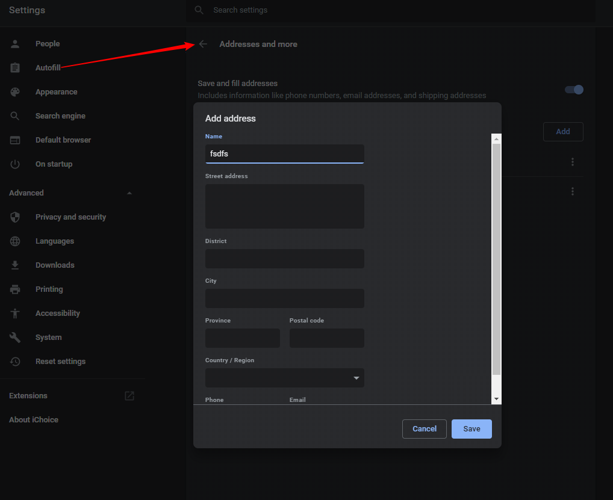

## 地址设置更新延迟现象


`src\chrome\browser\resources\settings\autofill_page\address_edit_dialog.html`

```html
<div id="select-row" class="address-row"><label id="select-label" class="cr-form-field-label">
            Country/Region
          </label><select class="md-select" aria-labelledby="select-label"><option value=""></option><option value="CN">
                China
              </option><option disabled="" value="SPACER">
```

```html
        <cr-button id="saveButton" class="action-button"
            disabled="[[!canSave_]]" on-click="onSaveButtonTap_">
          $i18n{save}
        </cr-button>
```

`src\chrome\browser\resources\settings\autofill_page\address_edit_dialog.js`
```js
  onSaveButtonTap_: function() {
    // The Enter key can call this function even if the button is disabled.
    if (!this.canSave_) {
      return;
    }

    // Set a default country if none is set.
    if (!this.address.countryCode) {
      this.address.countryCode = this.countries_[0].countryCode;
    }

    this.address.phoneNumbers = this.phoneNumber_ ? [this.phoneNumber_] : [];
    this.address.emailAddresses = this.email_ ? [this.email_] : [];

    this.fire('save-address', this.address);
    this.$.dialog.close();
  },
  ```